# EdgeLink

> 面向局域网环境的嵌入式边缘遥测系统：GD32 采集温度，先持久化到外部 Flash，再经 TCP 主链路或 CAN 回退链路上报至树莓派 EdgeHub；Hub 完成校验、SQLite 去重和 ACK 后，节点才确认删除对应的待发送记录。

| 维度 | 当前设计 |
| --- | --- |
| 采集节点 | GD32F103RCT6、FreeRTOS、BMP280、GD25Q32、ESP-AT、CAN |
| 边缘网关 | Raspberry Pi、C++17、`epoll`、SocketCAN、SQLite3 |
| 传输 | TCP V5 固定遥测帧为主；TCP 未确认时可走 CAN 回退 |
| 数据身份 | `(nodeId, sequence)` 是端到端去重与 ACK 匹配键 |
| 交付语义 | 节点 **at-least-once 重传**，Hub 以唯一索引实现幂等持久化 |
| 当前边界 | 已有源码和阶段性实机证据；完整 ACK 闭环、异常掉电恢复与当前 CAN 回退验收通过，72小时工作无死机 |

## 项目解决的问题

一个采集节点“把数据发出去”并不等于数据已经可靠进入网关：Wi-Fi/TCP 会中断，ESP 的 `SEND OK` 不代表 Hub 已落库，ACK 也可能在返回途中丢失，Flash 写到一半还可能突然掉电。

EdgeLink 因此把一次遥测交付拆成三个可以分别验证的事实：

```text
① 节点已持久化                ② Hub 已持久化                   ③ 节点已确认
BMP280 → Flash pending         Frame → SQLite                   ACK → Flash confirmed
             │                       │                                  │
             └──── 任何阶段失败，记录保持 pending，可在后续重新发送 ─────┘
```

这避免了两个常见错误：

- 收到 ESP `SEND OK` 就把本地记录删掉，导致 Hub 未落库时丢数；
- 因 ACK 丢失而拒绝重传，导致节点永久保留一条 Hub 实际已经保存的数据。

最终策略是：节点允许重发同一 `sequence`，Hub 对同一 `(nodeId, sequence)` 只保存一行并再次返回 ACK。它是“至少一次发送 + 幂等接收”，不是未验证就宣称的“恰好一次送达”。

## 实机演示

**4 块自制采集节点同时上电运行（LED 心跳交替闪烁）**

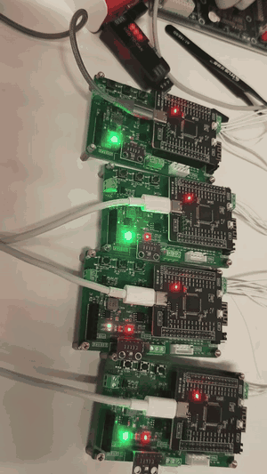

**节点正常运行：采集 → Flash 落盘 → TCP/CAN 上报**

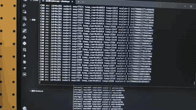

▶ [看原视频（清晰）](docs/develop/2026-09-22/video/平常运行演示.mp4)

**网关重启后节点自动重连，并补发积压的 pending**

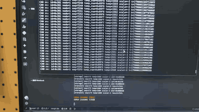

▶ [看原视频（清晰，含 3 倍速）](docs/develop/2026-09-22/video/重连一次性你发送pending.mp4)

> 终端录屏的 GIF 为了控制体积缩得较小、文字不易辨认；点上方原视频链接可清晰查看。

## 总体架构

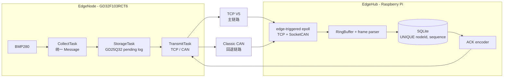

系统分为两条职责清晰的链：

1. **数据链**：传感器采样 → Message → Flash pending → TCP 或 CAN → Hub → SQLite。
2. **确认链**：SQLite 插入或去重命中 → ACK → 节点核对 `sequence` 与 CRC → Flash 状态改为 confirmed。

Flash 是数据链的本地恢复点，SQLite 是 Hub 侧的持久化事实源，ACK 是两者之间的确认桥梁。三者都不能被一次 socket 写成功替代。

## EdgeNode：分层与任务协作

### 分层边界

| 层级 | 目录 / 示例 | 只负责什么 |
| --- | --- | --- |
| BOARD | [`edgenode/Drivers/BOARD/`](edgenode/Drivers/BOARD/) | 时基、共享 SPI 总线与板级通用策略。 |
| BSP | [`edgenode/Drivers/BSP/`](edgenode/Drivers/BSP/) | BMP280、GD25Q32、CAN、ESP-AT 串口、IPS 等具体器件访问。 |
| APP / Protocol | [`edgenode/User/App/`](edgenode/User/App/) | Message、CRC、TCP V5/CAN 编码、FreeRTOS 队列和业务状态。 |
| Output | `Output/Storage`、`Output/Tcp`、`Output/Can` | 把统一 Message 变为 Flash、TCP 或 CAN 的实际输出。 |

这使“协议重试、Flash 确认”留在 APP，而不是污染设备驱动；也使 BMP280 与 GD25Q32 共用总线时，设备选择与底层时序仍属于 BOARD/BSP。

### 三个核心任务

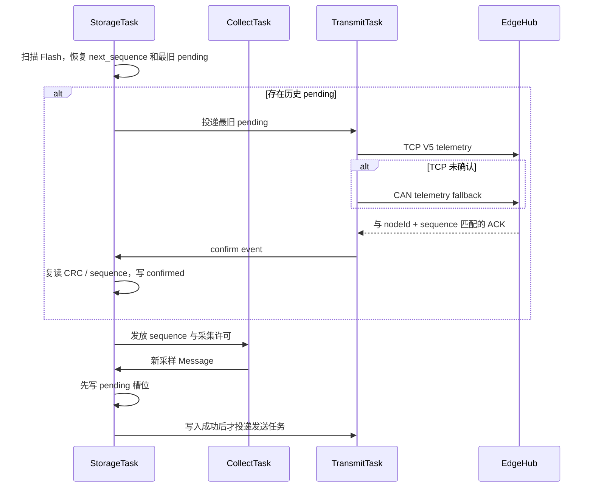

**StorageTask 是唯一写 Flash 的任务。** 它在启动时全量扫描日志区，恢复写指针和下一个 `sequence`；若存在历史 pending，会优先顺序补发。单条记录连续三次无法确认时，本轮补发停止，记录保留给后续重试，避免一条坏链路永久卡住启动。

**CollectTask 不直接发送。** 它只有在 StorageTask 发放许可后才采样，并将统一 Message 交回 StorageTask。这样写 Flash 失败、缓存不可继续写入或补发期间，不会继续静默产生无处保存的新数据。

**TransmitTask 不直接确认 Flash。** 它发送 TCP V5，校验固定长度 ACK 的版本、目标节点、CRC、状态码和 `sequence`。无有效 ACK 时再尝试重连与 CAN 回退；两条链路都未确认时只报告失败，记录仍为 pending。

### 节点侧失败分支

| 场景 | 当前处理 | 数据结果 |
| --- | --- | --- |
| 新采样还未写入 Flash 时掉电 | 没有提交给 TransmitTask。 | 本次未持久化样本无法恢复；已提交样本不被误确认。 |
| 已写 pending、尚未得到 ACK | 重启后扫描为 pending 并参与补发。 | 允许重传。 |
| ACK 丢失或 ACK 的 `sequence` 不匹配 | 不产生确认事件。 | 记录保持 pending，Hub 可用唯一索引消化重传。 |
| Storage 写入、读回或确认校验失败 | StorageTask 停止继续访问队列/外设。 | 宁可停止采集，也不静默跳过 sequence 或覆盖未知数据。 |
| CAN 无物理 ACK | CAN 控制器发送邮箱可能占满，TransmitTask 不会把它当 Hub 成功确认。 | Flash pending 保留。 |

## Flash 日志：恢复逻辑与容量边界

每条 Flash 记录固定为 16 字节：

```text
byte 0..3    sample_uptime_ms       节点采样时刻
byte 4..7    sequence               端到端业务身份
byte 8..9    temperature            int16，大端补码
byte 10      temperature_scale      int8，温度 = raw × 10^scale
byte 11..14  CRC32                  覆盖 byte 0..10
byte 15      status                 0x00 = confirmed；其他值 = pending
```

日志区物理地址可以回绕，但 `sequence` 不能回绕：Hub 不应把一次新的采样误认成早期数据。由于回绕后“低地址是新记录、中间为空、高地址仍有旧记录”是可能的，启动扫描不能在第一个全 `0xFF` 槽位停止，而是遍历整个日志区：

- CRC 正确的最大 `sequence` 用来恢复下一写地址和下一个序号；
- CRC 正确且未 confirmed 的最小 `sequence` 用来确定最先补发的记录；
- 非空但 CRC 错的槽位可能是掉电半写，不能当作有效数据，也不能再次编程。

当前实现在进入新 4 KiB 扇区前，会检查目标扇区是否仍含有效 pending；若存在则拒绝擦除。因此“长期离线时覆盖最旧 pending 以保持持续采集”目前只是待定容量策略，不应被包装成已经完成的功能。实现入口见 [`storage.c`](edgenode/User/App/Output/Storage/storage.c)。

## EdgeHub：事件循环、解析与幂等持久化

EdgeHub 的入口在 [`edgehub/main.cpp`](edgehub/main.cpp)，运行时资源由 [`Gateruntime`](edgehub/src/Gateruntime.cpp) 管理。`Gateruntime::init()` 会在 SocketCAN、TCP 监听、`epoll` 或 SQLite 初始化失败时返回 `false`；当前 `main.cpp` 尚未检查该返回值便调用 `run()`，这是一个应在后续修复并回归验证的启动失败路径风险。

```text
TCP listen :8888                  SocketCAN can0
       │                                  │
       └──────────────┬───────────────────┘
                      ▼
          edge-triggered epoll event loop
                      ▼
        每个 TCP 客户端独立 RingBuffer
                      ▼
     TCP V5 parser / CAN payload decoder
                      ▼
              unified Message
                      ▼
      SQLite INSERT ... ON CONFLICT DO NOTHING
                      ▼
          Inserted 或 Duplicate 才回复 ACK
```

### 为什么使用 `epoll + RingBuffer`

TCP 没有消息边界：一次 `recv` 可能只得到半帧，也可能得到多帧。Hub 为每个客户端维护独立 RingBuffer，解析结果明确区分三种状态：

- **pending**：字节不足一帧，保留数据等待下一次可读事件；
- **success**：完成 V5、节点号和 CRC 校验后，转换为 Message；
- **error**：错误帧导致关闭该客户端，避免损坏字节流不断进入业务层。

边沿触发模式下，收到事件后必须持续 `accept` / `recv` / CAN `read` 直到 `EAGAIN`，否则剩余数据不会再次触发通知。Hub 因而使用单一事件循环同时处理 TCP 监听、多个客户端和 `can0`，而不是为每条连接新建阻塞线程。

### 为什么 ACK 在 SQLite 之后

SQLite 表对 `(nodeId, sequence)` 建立唯一索引，写入使用：

```sql
INSERT INTO messages (nodeId, sequence, temperature, temperatureScale, receivedAtUs)
VALUES (?, ?, ?, ?, ?)
ON CONFLICT(nodeId, sequence) DO NOTHING;
```

| SQLite 结果 | Hub 行为 | 节点下一步 |
| --- | --- | --- |
| `Inserted` | 回成功 ACK。 | 核对后确认对应 Flash 槽位。 |
| `Duplicate` | 同样回成功 ACK。 | 结束旧 pending 的重传。 |
| `Error` | 记录错误，不回成功 ACK。 | 保持 pending，后续重试。 |

这就是幂等的关键：ACK 表示“Hub 已经拥有这个业务身份的记录”，不是“当前这次 socket 收包看起来没有报错”。`receivedAtUs` 为 Hub 完成整帧校验时的接收时间，不是节点 `sample_uptime_ms`。

## 协议契约

| 链路 | 遥测 | ACK | 当前作用 |
| --- | --- | --- | --- |
| TCP | `EH + V5 + source + target + sequence + temperature + scale + CRC32`，固定 16 B。 | 同为 16 B，`source=0`、`target=nodeId`、保留温度字段为 0、成功状态为 0。 | 局域网主上报路径。 |
| CAN | 标准 ID `0x280 + nodeId`，DLC 7：`sequence + temperature + scale`。 | 标准 ID `0x300 + nodeId`，DLC 5：`sequence + status`。 | TCP 未确认时的回退路径。 |

TCP 与 CAN 都承载同一个 Message，却不强行共用同一份线上帧：TCP 需要魔数、版本和 CRC 来应对字节流重同步；CAN 控制器已有链路层 CRC，且 8 字节 DLC 限制要求紧凑的独立布局。


## 构建与运行

### EdgeNode

- 构建规则：[`edgenode/Makefile`](edgenode/Makefile)，使用 ARM GNU Toolchain 生成 ELF 和 BIN。
- Windows 烧录入口：[`edgenode/flash.ps1`](edgenode/flash.ps1)。脚本会强制重新编译，再通过 ST-Link/OpenOCD 烧录、校验并复位。
- 节点的 Wi-Fi、Hub IP 与端口由 [`edgenode/User/App/Config/`](edgenode/User/App/Config/) 提供。不要提交真实 Wi-Fi 凭据。

### EdgeHub

- 依赖：Linux、CMake、C++17、SQLite3 开发包、已配置的 SocketCAN `can0`。
- 构建并前台运行：`cd edgehub && ./build.sh`。
- 当前源码监听 TCP **8888**，数据库路径为 `/home/qxc/Desktop/EdgeLink/edgehub/data/edgehub.db`。部署到其他目录前需调整该路径；启动前也应确认 `can0` 已按目标波特率 UP。

## 资料索引

- [EdgeNode 架构图（draw.io）](docs/draw/edgenode.drawio)
- [EdgeHub 架构图（draw.io）](docs/draw/edgehub.drawio)
- [开发日志索引](docs/develop/README.md)
- [TCP V5 与 ACK 编码实现](edgehub/inc/TcpFrame.hpp)
- [2026-09-15 调试记录](docs/develop/2026-09-15/main.md)

## 项目边界

`edgedash/` 是独立的 EasyUI 仪表板原型，不属于本 README 的交付说明。本文只陈述当前仓库源码及已保留实机记录能支持的结论；尚未完成的验证明确保留为下一步，不用架构设计或截图替代。

## 硬件原理图与 PCB

`docs/PCB/` 保存 EdgeNode 的硬件设计预览，分为核心控制板（`CORE`）和扩展采集板（`EXP`）。下面的图片用于让读者快速核对软件所依赖的电源、MCU、调试和外设接口边界；它们是原理图/布局导出，不代替已焊接板的上电、信号完整性或外设实测结论。

### 核心控制板（CORE）

核心板以 GD32F103RCT6 为控制中心，提供 Type-C 供电与 CH340 串口、SWD 下载接口、8 MHz 与 32.768 kHz 时钟、复位/唤醒按键、3.3 V 降压电源及向扩展板引出的排针接口。

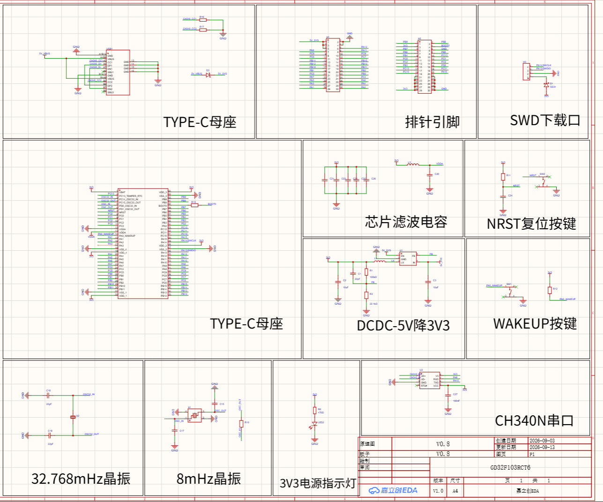

### 扩展采集板（EXP）

扩展板将网络、现场总线、采集、显示和供电模块集中到核心板接口：

- ESP-12S Wi-Fi 与 2.4 GHz 天线区域，对应节点的 ESP-AT TCP 通路；
- SN65HVD230 CAN 收发器，对应 TCP 未确认时的 CAN 回退设计；
- SPI Flash 与 BMP280 接口，对应本地 pending 日志与温度采样；
- IPS 显示接口、RS485、12 V 电压采样、按键、PWM 和 12 V → 5 V 电源链路。

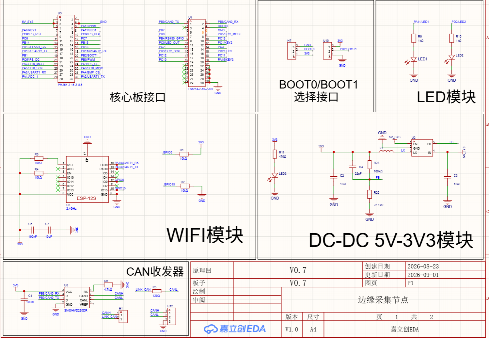

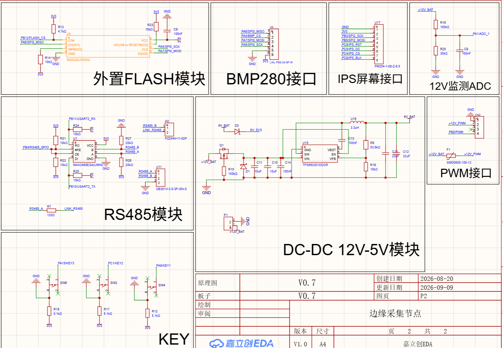

### PCB 布局预览

原理图说明电气连接，PCB 截图说明模块在两块板上的实际布局和走线分区。`PCB_ON` 为顶层预览，`PCB_OFF` 为底层预览；完整导出文件位于 [`docs/PCB/CORE/`](docs/PCB/CORE/) 与 [`docs/PCB/EXP/`](docs/PCB/EXP/)。

#### 核心控制板 PCB

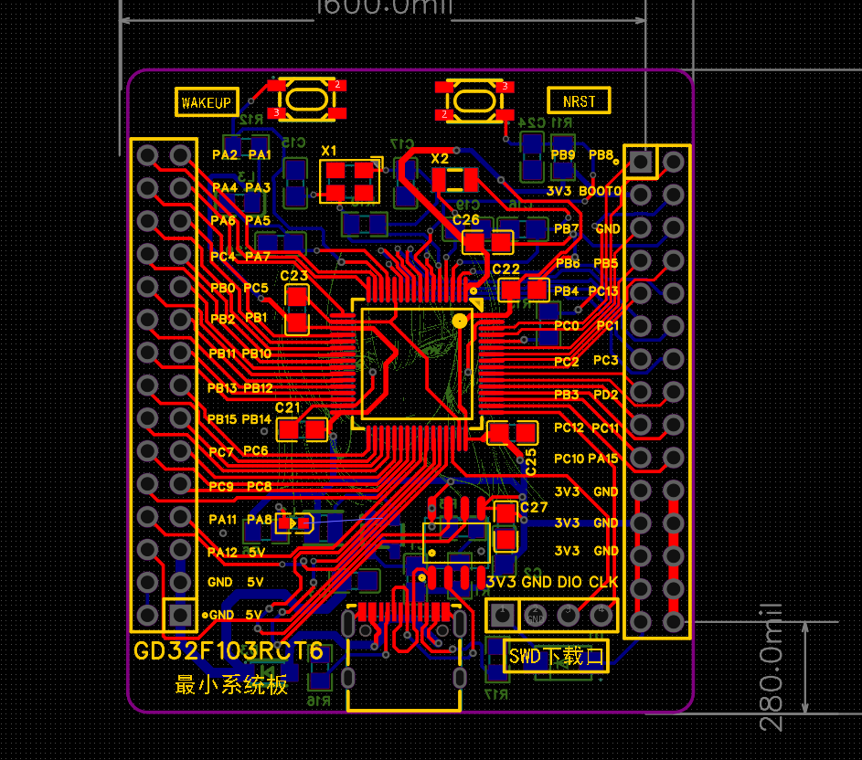

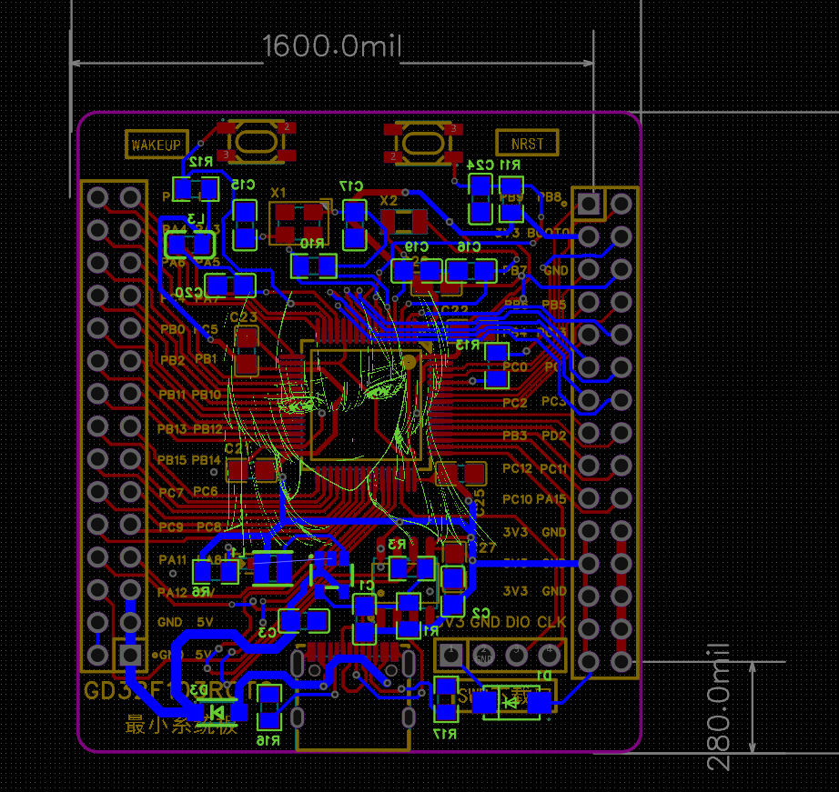

#### 扩展采集板 PCB

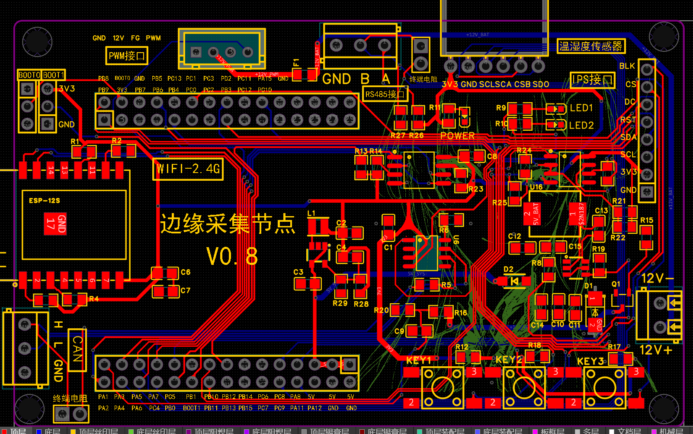

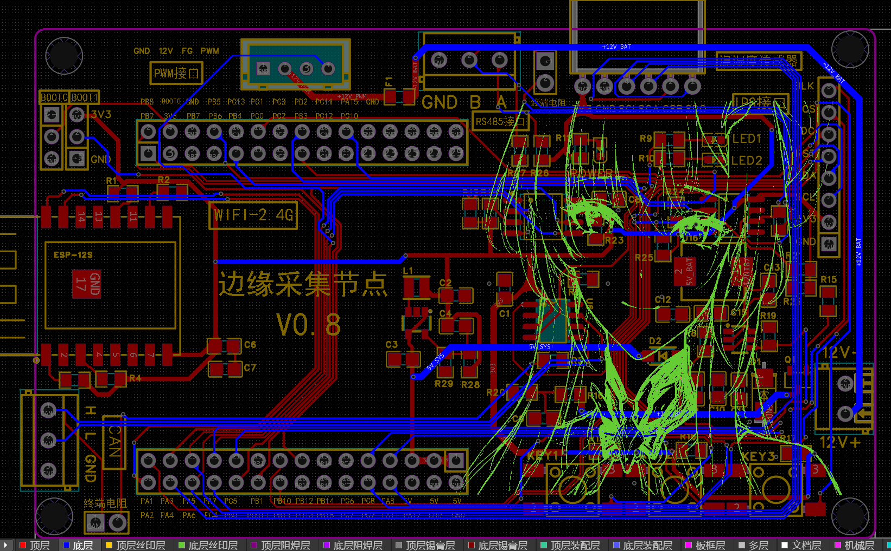
