# EdgeLink

> 面向局域网环境的嵌入式边缘遥测与固件更新系统：GD32 节点采集温度，先持久化到外部 Flash，再经 TCP 或 CAN 上报至树莓派 EdgeHub；Hub 完成 SQLite 落库或去重并回复 ACK 后，节点才将对应记录标记为已确认。Hub 同时提供 HTTP 管理接口，通过 CAN 查询节点的可升级槽位、下发应用固件，并根据节点反馈推进发送和处理重传。

| 维度 | 当前设计 |
| --- | --- |
| 采集节点 | GD32F103RCT6、FreeRTOS、BMP280、GD25Q32、ESP-AT、CAN、ST7789 IPS |
| 边缘网关 | Raspberry Pi、C++17、`epoll`、SocketCAN、SQLite3 |
| 传输 | TCP V5 固定遥测帧为主；TCP 未确认时可走 CAN 回退 |
| 数据身份 | `(nodeId, sequence)` 是端到端去重与 ACK 匹配键 |
| 交付语义 | 节点 **at-least-once 重传**，Hub 以唯一索引实现幂等持久化 |
| 链路恢复 | 运行期断线自动重连，重连成功后补发积压 pending |
| 节点显示 | 320×240 IPS 四页：HOME / LINKS / LOG / STORAGE |
| 管理接口 | HTTP `:8080`：服务状态、节点槽位查询、指定节点固件下发 |
| 固件更新 | HTTP 发起 → CAN 8 帧确认窗口与超时重传 → GD25Q32 中转校验 → Bootloader 安装到内部 Flash A/B 槽 |
| 当前进度 | 遥测主链路已有阶段性实机记录；OTA 两端主体代码已实现，Hub 窗口发送已通过编译和故障模拟测试，完整设备升级待实机验收 |

## 快速开始

先配置并启动 Node 与 Hub，再通过 HTTP 查询槽位或下发固件。

### EdgeNode（GD32F103RCT6）

```powershell
# 1. 改配置：Wi-Fi SSID/密码、Hub 的 IP 与端口，以及本节点的 board_id
#    edgenode/User/App/Config/config.c

# 2. 编译三套 APP（默认布局、A 槽、B 槽；需要 ARM GNU Toolchain）
./edgenode/tools/compiled.ps1

# 3. 准备使用 OTA 的设备：先烧 Bootloader，再烧初始 A 槽应用
#    需要已连接的 ST-Link 和 OpenOCD
./edgenode/bootloader/flash.ps1
./edgenode/tools/flash.ps1 a
```

这些烧录命令会写入设备 Flash，适用于首次部署。只运行旧的独立 APP 布局时，可使用 `./edgenode/tools/flash.ps1 default`；它会覆盖 Bootloader 所在地址。脚本内的工具链路径需要按本机安装位置调整。

`board_id` 范围为 1～127，决定 TCP Frame 的 source 和 CAN 仲裁 ID，**同一个 Hub 下的节点不能重复**。

### EdgeHub（树莓派）

```bash
# 1. can0 配一次（build.sh 故意不做这件事，原因见下方「构建与运行」）
sudo ip link set can0 up type can bitrate 500000

# 2. 编译并在前台运行，监听遥测 TCP 8888 和管理 HTTP 8080
cd edgehub && ./build.sh

# 3. 在另一个终端检查服务状态
curl http://192.168.1.112:8080/hub/status
```

地址替换为实际 Hub IP；当前状态接口返回 `{"running":true}`。固件下发步骤见 [HTTP 管理与固件下发](#http-管理与固件下发)。

## 目录

- [快速开始](#快速开始)
- [项目解决的问题](#项目解决的问题)
- [实机演示](#实机演示)
- [总体架构](#总体架构)
- [EdgeNode：分层与任务协作](#edgenode分层与任务协作)
- [EdgeNode：节点侧 HMI](#edgenode节点侧-hmi)
- [EdgeNode：固件更新](#edgenode固件更新)
- [Flash 日志：恢复逻辑与容量边界](#flash-日志恢复逻辑与容量边界)
- [EdgeHub：事件循环、解析与幂等持久化](#edgehub事件循环解析与幂等持久化)
- [HTTP 管理与固件下发](#http-管理与固件下发)
- [协议契约](#协议契约)
- [构建与运行](#构建与运行)
- [资料索引](#资料索引)
- [项目边界](#项目边界)
- [硬件原理图与 PCB](#硬件原理图与-pcb)

## 项目解决的问题

一个采集节点“把数据发出去”并不等于数据已经可靠进入网关：Wi-Fi/TCP 会中断，ESP 的 `SEND OK` 不代表 Hub 已落库，ACK 也可能在返回途中丢失，Flash 写到一半还可能突然掉电。

EdgeLink 因此把一次遥测交付拆成三个可以分别验证的事实：

```text
① 节点已持久化                ② Hub 已持久化                   ③ 节点已确认
BMP280 → Flash pending         Frame → SQLite                   ACK → Flash confirmed
             │                       │                                  │
             └──── 任何阶段失败，记录保持 pending，可在后续重新发送 ─────┘
```

这避免了两个常见错误：

- 收到 ESP `SEND OK` 就把本地记录删掉，导致 Hub 未落库时丢数；
- 因 ACK 丢失而拒绝重传，导致节点永久保留一条 Hub 实际已经保存的数据。

最终策略是：节点允许重发同一 `sequence`，Hub 对同一 `(nodeId, sequence)` 只保存一行并再次返回 ACK。它是“至少一次发送 + 幂等接收”，不是未验证就宣称的“恰好一次送达”。

## 实机演示

**4 块自制采集节点同时上电运行（LED 心跳交替闪烁）**

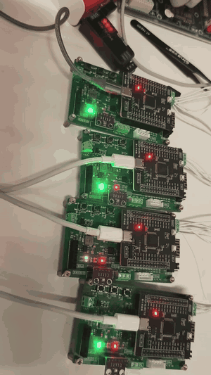

**节点正常运行：采集 → Flash 落盘 → TCP/CAN 上报**

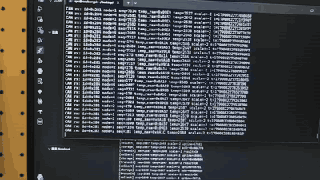

▶ [看原视频（清晰）](docs/develop/2026-09-22/video/平常运行演示.mp4)

**网关重启后节点自动重连，并补发积压的 pending**

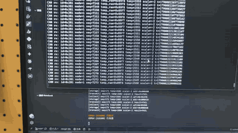

▶ [看原视频（清晰，含 3 倍速）](docs/develop/2026-09-22/video/重连一次性你发送pending.mp4)

> 终端录屏的 GIF 为了控制体积缩得较小、文字不易辨认；点上方原视频链接可清晰查看。

## 总体架构

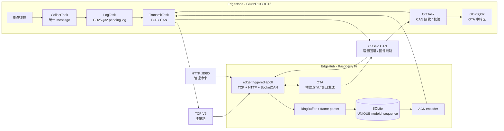
```mermaid
flowchart LR
    subgraph Node[EdgeNode - GD32F103RCT6]
        Sensor[BMP280]
        Collect[CollectTask\n统一 Message]
        Log[LogTask\nGD25Q32 pending log]
        Tx[TransmitTask\nTCP / CAN]
        NodeOta[OtaTask\nCAN 接收 / 校验]
        Relay[GD25Q32\nOTA 中转区]
        Sensor --> Collect --> Log --> Tx
        NodeOta --> Relay
        NodeOta --> Tx
    end

    Tcp[TCP V5\n主链路]
    Can[Classic CAN\n遥测回退 / 固件链路]
    Tx --> Tcp
    Tx --> Can

    subgraph Hub[EdgeHub - Raspberry Pi]
        Epoll[edge-triggered epoll\nTCP + HTTP + SocketCAN]
        Parser[RingBuffer + frame parser]
        Db[(SQLite\nUNIQUE nodeId, sequence)]
        Ack[ACK encoder]
        OtaHub[OTA\n槽位查询 / 窗口发送]
        Epoll --> Parser --> Db --> Ack
        Epoll <--> OtaHub
    end

    Tcp --> Epoll
    Can --> Epoll
    Can --> NodeOta
    Http[HTTP :8080\n管理命令] --> Epoll
    OtaHub --> Can
    Ack --> Tx
```

系统分为三条业务链：

1. **数据链**：传感器采样 → Message → Flash pending → TCP 或 CAN → Hub → SQLite。
2. **确认链**：SQLite 插入或去重命中 → ACK → 节点核对 `sequence` 与 CRC → Flash 状态改为 confirmed。
3. **固件链**：HTTP 指定目标与镜像路径 → Hub 经 CAN 下发 → Node 上报连续接收序号 → 中转区完整镜像校验 → 复位后 Bootloader 安装与试启动。

Flash 是数据链的本地恢复点，SQLite 是 Hub 侧的持久化事实源，ACK 是两者之间的确认桥梁。三者都不能被一次 socket 写成功替代。

## EdgeNode：分层与任务协作

### 分层边界

| 层级 | 目录 / 示例 | 只负责什么 |
| --- | --- | --- |
| BOARD | [`edgenode/Drivers/BOARD/`](edgenode/Drivers/BOARD/) | 时基、共享 SPI 总线与板级通用策略。 |
| BSP | [`edgenode/Drivers/BSP/`](edgenode/Drivers/BSP/) | BMP280、GD25Q32、CAN、ESP-AT 串口、IPS 等具体器件访问。 |
| APP / Protocol | [`edgenode/User/App/`](edgenode/User/App/) | Message、TCP V5/CAN 编码、队列和业务状态；OTA 的协议判断位于 `Service/Ota`。 |
| FreeRTOS Tasks | [`edgenode/User/App/FreeRtos/Tasks/`](edgenode/User/App/FreeRtos/Tasks/) | Collect、Log、Transmit、Ota、Hmi、LED、StackMonitor 各有独立任务文件；任务负责调度和队列交接。 |
| Output | `Output/Log`、`Output/Tcp`、`Output/Can` | 把统一 Message 变为 Flash 日志、TCP 或 CAN 的实际输出。 |
| Bootloader / OTA | [`edgenode/bootloader/`](edgenode/bootloader/)、[`edgenode/Common/OTA/`](edgenode/Common/OTA/) | 校验镜像、管理内部 Flash 槽位和启动元数据；Bootloader 是独立工程。 |

这使“协议重试、Flash 确认”留在 APP，而不是污染设备驱动；也使 BMP280 与 GD25Q32 共用总线时，设备选择与底层时序仍属于 BOARD/BSP。

### 遥测主链上的三个任务

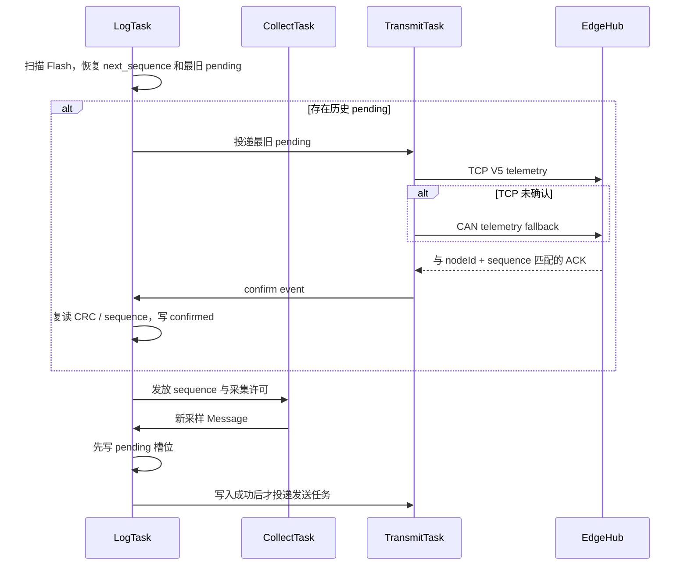
```mermaid
sequenceDiagram
    participant S as LogTask
    participant C as CollectTask
    participant T as TransmitTask
    participant H as EdgeHub

    S->>S: 扫描 Flash，恢复 next_sequence 和最旧 pending
    alt 存在历史 pending
        S->>T: 投递最旧 pending
        T->>H: TCP V5 telemetry
        alt TCP 未确认
            T->>H: CAN telemetry fallback
        end
        H-->>T: 与 nodeId + sequence 匹配的 ACK
        T->>S: confirm event
        S->>S: 复读 CRC / sequence，写 confirmed
    end
    S->>C: 发放 sequence 与采集许可
    C->>S: 新采样 Message
    S->>S: 先写 pending 槽位
    S->>T: 写入成功后才投递发送任务
```

**LogTask 负责遥测日志的 Flash 写入与确认。** 它在启动时全量扫描日志区，恢复写指针和下一个 `sequence`；若存在历史 pending，会优先顺序补发。单条记录连续三次无法确认时，本轮补发停止，记录保留给后续重试，避免一条坏链路永久卡住启动。

**CollectTask 不直接发送。** 它只有在 LogTask 发放许可后才采样，并将统一 Message 交回 LogTask。这样写 Flash 失败、缓存不可继续写入或补发期间，不会继续静默产生无处保存的新数据。

**TransmitTask 不直接确认 Flash。** 它先尝试 TCP V5，校验 ACK 的版本、目标节点、CRC、状态码和 `sequence`。TCP 未成功确认时回退 CAN，随后按冷却时间尝试恢复 TCP；两条链路都未确认时只报告失败，记录仍为 pending。TCP 重连和 CAN 发送目前共用这个任务，TCP 不通时 CAN 上报卡顿的问题由 [#7](https://github.com/xccloop/EdgeLink/issues/7) 跟踪。

其余任务各有自己的入口：`OtaTask` 接收 CAN 固件帧并把回复交给 TransmitTask 发送；`HmiTask` 绘制屏幕；LED 任务负责指示；StackMonitor 任务检查任务栈。它们不改变上面“先落盘、后发送、ACK 后确认”的遥测顺序。

### 节点侧失败分支

| 场景 | 当前处理 | 数据结果 |
| --- | --- | --- |
| 新采样还未写入 Flash 时掉电 | 没有提交给 TransmitTask。 | 本次未持久化样本无法恢复；已提交样本不被误确认。 |
| 已写 pending、尚未得到 ACK | 重启后扫描为 pending 并参与补发。 | 允许重传。 |
| ACK 丢失或 ACK 的 `sequence` 不匹配 | 不产生确认事件。 | 记录保持 pending，Hub 可用唯一索引消化重传。 |
| 日志写入、读回或确认校验失败 | LogTask 停止继续访问队列/外设。 | 宁可停止采集，也不静默跳过 sequence 或覆盖未知数据。 |
| CAN 无物理 ACK | CAN 控制器发送邮箱可能占满，TransmitTask 不会把它当 Hub 成功确认。 | Flash pending 保留。 |

## EdgeNode：节点侧 HMI

节点带一块 320×240 的 ST7789 IPS 屏，由 `hmi_task` 独占驱动（1 ms 周期）。它**不直接读**传感器、Flash 或 ESP——其他任务把数据填进一份完整快照（`hmi_view_data_t`），HMI 只负责显示。

| 页面 | 显示什么 | 数据来源 |
| --- | --- | --- |
| **HOME** | 温度、Wi-Fi 名字与本机 IP | `collect_to_hmi_queue`；`tcp_ssid_get()` / `tcp_local_ip_get()` |
| **LINKS** | TCP / CAN 最近一次通信结果 | `tcp_connected_get()`；`can_state` |
| **LOG** | 最近 5 次收发的滚动窗口（终端式，新的从下面进） | `transmit_to_hmi_log_queue`——TransmitTask 每发完一条交一行 |
| **STORAGE** | Flash 里还没被 Hub 确认的 pending 条数 | `log_pending_count_get()` |

底部 28 像素是导航条：**KEY1/KEY2** 移动候选页，**KEY3** 确认切换。按键走 EXTI 中断 + 位图事件，由 HMI 任务取走并做 50 ms 去抖。

刷新不是整屏双缓冲：`hmi_service()` 每次只合成**一行**，212 行的正文要约 212 ms 画完，所以物理屏幕上能看到逐行刷新。绘制期间的数据更新不会打断当前场景——`hmi_set_view_data()` 把待刷新行范围合并起来，等空闲时再一起提交。

四个页面都无法自行探测或推断状态：链路状态只反映「调用方最近一次观测」，`UNKNOWN` 表示「还没有结果」，和 `OFFLINE`（确认失败）不是一回事。**STORAGE 页是唯一能看出「数据压在本地没发出去」的地方**——断网时它只涨，链路恢复补发后它回落。

分层见 [`Presentation/Hmi/`](edgenode/User/App/Presentation/Hmi/)：

```text
Widget  →  Page   →  Render  →  Control
点阵字体    页面坐标    逐行合成    持有快照、当前页、
矩形/文本   配色       交 DMA      待刷新范围
```

## EdgeNode：固件更新

Node 的 OTA 接收队列与遥测队列分开：CAN 中断把固件数据帧和槽位查询帧交给 `OtaTask`，[`Service/Ota/ota.c`](edgenode/User/App/Service/Ota/ota.c) 判断序号、按 768 B 块缓存数据并写入 GD25Q32 中转区。每连续接收 8 帧，或接收停顿时，Node 上报当前连续收到的帧序号。回复统一由 TransmitTask 发送。

完整镜像校验通过后，Node 回复接收结果并准备复位；独立的 [`bootloader/`](edgenode/bootloader/) 再校验中转镜像、安装到非当前活动的内部 Flash 槽，并根据启动元数据决定试启动或回退。新 APP 运行约 10 秒后调用 `ota_confirm_boot()` 确认本次启动。Hub 下发的是带镜像头的应用固件，Bootloader 通过 SWD 首次部署。

| 内部 Flash 区域 | 起始地址 | 容量 | 内容 |
| --- | --- | ---: | --- |
| Bootloader | `0x08000000` | 16 KiB | 启动、校验、安装与回退逻辑 |
| A 槽 | `0x08004000` | 118 KiB | 256 B 镜像头 + A 版 APP |
| B 槽 | `0x08021800` | 118 KiB | 256 B 镜像头 + B 版 APP |
| OTA 元数据 | `0x0803F000` | 4 KiB | 活动槽、待确认槽等启动状态 |

[`tools/compiled.ps1`](edgenode/tools/compiled.ps1) 一次编出 `build/default`、`build/a`、`build/b`。A/B 槽必须烧录带镜像头的 `edegnode_image.bin`；[`tools/flash.ps1`](edgenode/tools/flash.ps1) 按 `default`、`a`、`b` 选择文件和固定地址，A/B 烧录前检查镜像格式、槽位和 CRC。`default` 是从 `0x08000000` 启动的旧布局，烧录它会覆盖 Bootloader。

外部 GD25Q32 的分区由 [`external_flash_layout.h`](edgenode/Common/ExFlash/external_flash_layout.h) 统一定义：`[0x000000, 0x3BF000)` 用于遥测日志，`[0x3BF000, 0x400000)` 用于 OTA 中转，避免固件接收覆盖待发送遥测记录。

**验证情况：**APP 三种布局和 Bootloader 已有编译通过记录；Hub 的窗口发送、超时重传和结果处理已通过故障模拟测试。CAN 接收、中转安装、试启动确认、回退及异常掉电恢复仍待作为完整链路在设备上验收。镜像 CRC 用于发现损坏，当前未实现固件签名认证。

## Flash 日志：恢复逻辑与容量边界

每条 Flash 记录固定为 16 字节：

```text
byte 0..3    sample_uptime_ms       节点采样时刻
byte 4..7    sequence               端到端业务身份
byte 8..9    temperature            int16，大端补码
byte 10      temperature_scale      int8，温度 = raw × 10^scale
byte 11..14  CRC32                  覆盖 byte 0..10
byte 15      status                 0x00 = confirmed；其他值 = pending
```

日志区物理地址可以回绕，但 `sequence` 不能回绕：Hub 不应把一次新的采样误认成早期数据。由于回绕后“低地址是新记录、中间为空、高地址仍有旧记录”是可能的，启动扫描不能在第一个全 `0xFF` 槽位停止，而是遍历整个日志区：

- CRC 正确的最大 `sequence` 用来恢复下一写地址和下一个序号；
- CRC 正确且未 confirmed 的最小 `sequence` 用来确定最先补发的记录；
- 非空但 CRC 错的槽位可能是掉电半写，不能当作有效数据，也不能再次编程。

当前实现在进入新 4 KiB 扇区前，会检查目标扇区是否仍含有效 pending；若存在则拒绝擦除。因此“长期离线时覆盖最旧 pending 以保持持续采集”目前只是待定容量策略，不应被包装成已经完成的功能。实现入口见 [`log.c`](edgenode/User/App/Output/Log/log.c)。

## EdgeHub：事件循环、解析与幂等持久化

EdgeHub 的入口在 [`edgehub/main.cpp`](edgehub/main.cpp)，运行时资源由 [`Gateruntime`](edgehub/src/Gateruntime.cpp) 管理。`Gateruntime::init()` 在 SocketCAN、TCP 监听、`epoll` 或 SQLite 任一步失败时返回 `false`，`main.cpp` 会**就此退出**，不会带着没建好的 `epoll` 进入事件循环——否则会报出一句误导人的 `epoll error: Invalid argument`，把真正的失败原因（比如端口已被占用）盖住。

```text
TCP :8888          HTTP :8080          SocketCAN can0
    │                   │                    │
    └───────────────────┼────────────────────┘
                        ▼
             edge-triggered epoll
        ┌───────────────┼────────────────┐
        ▼               ▼                ▼
      遥测帧         HTTP 请求         CAN OTA 回复
        │               │                │
TCP RingBuffer /     路由解析        查询匹配 / 窗口确认
CAN payload decoder     └────────┬───────┘
        │                        ▼
  unified Message           OTA 业务结果
        │                        │
 SQLite 插入 / 去重         HTTP 响应
        │
成功或已存在才回复 ACK
```

上图的持久化路径用于遥测。HTTP 客户端由独立的请求解析状态处理，OTA 回复先交给 [`OTA`](edgehub/src/OTA.cpp)，再由 `Gateruntime` 关联等待中的 HTTP 请求；固件窗口发送和超时检查在事件批次结束后推进。

### 为什么使用 `epoll + RingBuffer`

TCP 没有消息边界：一次 `recv` 可能只得到半帧，也可能得到多帧。Hub 为每个客户端维护独立 RingBuffer，解析结果明确区分三种状态：

- **pending**：字节不足一帧，保留数据等待下一次可读事件；
- **success**：完成 V5、节点号和 CRC 校验后，转换为 Message；
- **error**：错误帧导致关闭该客户端，避免损坏字节流不断进入业务层。

边沿触发模式下，收到事件后必须持续 `accept` / `recv` / CAN `read` 直到 `EAGAIN`，否则剩余数据不会再次触发通知。Hub 因而使用单一事件循环同时处理 TCP 监听、多个客户端和 `can0`，而不是为每条连接新建阻塞线程。

### 为什么 ACK 在 SQLite 之后

SQLite 表对 `(nodeId, sequence)` 建立唯一索引，写入使用：

```sql
INSERT INTO messages (nodeId, sequence, temperature, temperatureScale, receivedAtUs)
VALUES (?, ?, ?, ?, ?)
ON CONFLICT(nodeId, sequence) DO NOTHING;
```

| SQLite 结果 | Hub 行为 | 节点下一步 |
| --- | --- | --- |
| `Inserted` | 回成功 ACK。 | 核对后确认对应 Flash 槽位。 |
| `Duplicate` | 同样回成功 ACK。 | 结束旧 pending 的重传。 |
| `Error` | 记录错误，不回成功 ACK。 | 保持 pending，后续重试。 |

这就是幂等的关键：ACK 表示“Hub 已经拥有这个业务身份的记录”，不是“当前这次 socket 收包看起来没有报错”。`receivedAtUs` 为 Hub 完成整帧校验时的接收时间，不是节点 `sample_uptime_ms`。

## HTTP 管理与固件下发

HTTP 服务监听 `8080`。节点号使用十进制 1～127，槽位查询与固件下发是两个独立操作，由调用者查询后选择对应镜像。

| 方法 | 路径 | 行为 |
| --- | --- | --- |
| `GET` | `/hub/status` | 返回 `{"running":true}`，用于检查服务响应。 |
| `GET` | `/hub/firmware/query/node/<id>` | 经 CAN 查询非当前运行的槽位，成功返回 `{"slot":"A"}` 或 `{"slot":"B"}`，查询超时为 5 s。 |
| `POST` | `/hub/firmware/send/node/<id>` | 请求体为 **Hub 本地镜像文件路径**；启动 CAN 下发，等待 Node 最终结果或失败后返回。 |

以下以节点 3、树莓派 `192.168.1.112` 为例。

### 1. 查询目标槽位

```bash
curl http://192.168.1.112:8080/hub/firmware/query/node/3
```

若返回 `{"slot":"B"}`，选择 `edgenode/build/b/edegnode_image.bin`；返回 A 则选择 A 槽镜像。节点存在待确认升级或元数据无效时，接口返回错误。

### 2. 把对应镜像复制到 Hub

在编译完成后的 Windows 仓库根目录运行，下面的命令对应查询结果为 B：

```powershell
scp ./edgenode/build/b/edegnode_image.bin qxc@192.168.1.112:/home/qxc/Desktop/edegnode_b_image.bin
```

### 3. 发起下发

```bash
curl -i -X POST \
  http://192.168.1.112:8080/hub/firmware/send/node/3 \
  --data-raw '/home/qxc/Desktop/edegnode_b_image.bin'
```

`--data-raw` 发送路径字符串，Hub 按该路径打开文件；镜像内容通过上一步复制到树莓派。`-i` 显示 HTTP 状态码。Windows PowerShell 可使用 `curl.exe`，并将命令写为一行。

Hub 当前只允许一个固件发送任务。每帧携带 2 B 序号与 6 B 镜像数据，最多允许 8 帧未确认；收到 Node 的连续接收序号后推进窗口，500 ms 未获得进度时从未确认位置重传，连续最多重试 3 次。全部帧获进度确认后，最终结果等待时间为 5 s；有效的最终成功回复也可直接完成传输。

成功响应包含 `submitted`、`node`、`submitted_bytes` 和 `relay_verified`。`submitted=true` 表示整个文件已提交到 CAN 发送接口；`relay_verified=true` 表示 Hub 收到 Node 的中转镜像校验成功回复。新 APP 的安装、启动和确认发生在节点复位之后，当前 HTTP 响应不报告这些阶段的结果。

文件不存在返回 404，传输忙或节点有待确认槽位返回 409，CAN 发送失败返回 503，确认超时返回 504。错误响应会提供 `error`；发送已经启动时还保留字节计数和校验结果，便于判断失败发生在哪个阶段。

## 协议契约

| 链路 | 遥测 | ACK | 当前作用 |
| --- | --- | --- | --- |
| TCP | `EH + V5 + source + target + sequence + temperature + scale + CRC32`，固定 16 B。 | 同为 16 B，`source=0`、`target=nodeId`、保留温度字段为 0、成功状态为 0。 | 局域网主上报路径。 |
| CAN | 标准 ID `0x280 + nodeId`，DLC 7：`sequence + temperature + scale`。 | 标准 ID `0x300 + nodeId`，DLC 5：`sequence + status`。 | TCP 未确认时的回退路径。 |

TCP 与 CAN 都承载同一个 Message，却不强行共用同一份线上帧：TCP 需要魔数、版本和 CRC 来应对字节流重同步；CAN 控制器已有链路层 CRC，且 8 字节 DLC 限制要求紧凑的独立布局。

### CAN 固件协议

帧均为标准数据帧，以下多字节字段高字节在前，固件数据序号从 0 开始。

| 方向 | CAN ID | DLC | 载荷 |
| --- | --- | ---: | --- |
| Hub → Node | `0x380 + nodeId` | 8 | `sequence(2) + image_bytes(6)`，最后一帧不足部分填 `0xFF`。 |
| Hub → Node | `0x400 + nodeId` | 4 | `1 + request_id(2) + 0`，只查询可升级槽位。 |
| Node → Hub | `0x480 + nodeId` | 4 | `kind=1 + contiguous(2) + 0`，报告已连续收到第 N 帧。 |
| Node → Hub | `0x480 + nodeId` | 4 | `kind=2 + contiguous(2) + success`，`success=1` 表示中转区镜像校验成功。 |
| Node → Hub | `0x480 + nodeId` | 8 | `kind=3 + request_id(2) + status + target_slot(4)`，回复槽位地址。 |

槽位回复状态：0 为成功，1 为元数据无效，2 为存在待确认槽位；失败时目标地址为 0。成功地址为 A 槽 `0x08004000` 或 B 槽 `0x08021800`。例如 Node 3 的查询帧为 `0x403`，槽位、进度和结果回复都使用 `0x483`。

协议定义和实现见 [`can_frame.h`](edgenode/User/App/Protocol/Can/can_frame.h)、[`can_output.c`](edgenode/User/App/Output/Can/can_output.c) 与 [`OTA.cpp`](edgehub/src/OTA.cpp)。

## 构建与运行

### EdgeNode

- 构建规则：[`edgenode/Makefile`](edgenode/Makefile)，使用 ARM GNU Toolchain 生成 ELF 和 BIN。
- Windows 编译入口：[`edgenode/tools/compiled.ps1`](edgenode/tools/compiled.ps1)，生成 `build/default`、`build/a`、`build/b` 三套产物。
- Bootloader 构建：[`edgenode/bootloader/Makefile`](edgenode/bootloader/Makefile)；[`edgenode/bootloader/flash.ps1`](edgenode/bootloader/flash.ps1) 会重新编译并通过 ST-Link 烧录到 `0x08000000`。
- Windows 烧录入口：[`edgenode/tools/flash.ps1`](edgenode/tools/flash.ps1)，传入 `default`、`a` 或 `b`，将对应的已编译镜像写入该布局的 Flash 起始地址并校验。`default` 会覆盖 `0x08000000` 上的 Bootloader；A/B 槽需要设备已有 Bootloader，烧录前会校验镜像完整性。
- **节点配置**：Wi-Fi 凭据、Hub 地址和 `board_id` 都在 [`edgenode/User/App/Config/config.c`](edgenode/User/App/Config/config.c)，由 `config_tcp_get()` 提供给 TCP 层。`board_id` 同时决定 TCP Frame 的 source 和 CAN 仲裁 ID，**同一个 Hub 下的节点不能重复**。

### EdgeHub

- 依赖：Linux、CMake、C++17、SQLite3 开发包、已配置的 SocketCAN `can0`。
- 构建并前台运行：`cd edgehub && ./build.sh`。
- 当前源码监听遥测 TCP **8888**、管理 HTTP **8080**，数据库路径为 `/home/qxc/Desktop/EdgeLink/edgehub/data/edgehub.db`。部署到其他目录前需调整这个路径，并保证数据库目录存在且可写。
- **`build.sh` 不配置 `can0`**，因为两件事都不合适：接口已在 UP 状态时不能在线改波特率，`ip` 会报 `RTNETLINK answers: Device or resource busy`，而 `set -e` 会让脚本当场退出、Edgehub 跟着起不来；改成先 `down` 再 `up` 虽然能绕开，却会在每次编译运行时把总线断开一下，还要每次输 sudo。所以这件事留在外面，开机手动配一次：

  ```bash
  sudo ip link set can0 up type can bitrate 500000
  ```

## 资料索引

- [EdgeNode 架构图（draw.io）](docs/draw/edgenode.drawio)
- [EdgeHub 架构图（draw.io）](docs/draw/edgehub.drawio)
- [开发日志索引](docs/develop/README.md)
- [TCP V5 与 ACK 编码实现](edgehub/inc/TcpFrame.hpp)
- [Hub HTTP 路由](edgehub/src/HttpHandle.cpp)
- [Hub CAN 固件发送与回复处理](edgehub/src/OTA.cpp)
- [Node 内部 Flash 分区](edgenode/Common/OTA/flash_layout.h)
- [已知问题与后续工作](https://github.com/xccloop/EdgeLink/issues)
- [2026-09-15 调试记录](docs/develop/2026-09-15/main.md)

## 项目边界

当前阶段已实现 Node 遥测、Flash 日志恢复、Hub 持久化与 ACK，以及 CAN 应用固件下发的主体功能。项目保留的遥测实机记录涵盖多节点运行、断线重连与 pending 补发，并记载过 72 小时无死机运行。OTA 的编译与模拟测试结果单独记录，完整升级和故障恢复仍需设备验收。

后续工作集中在现有 issue：

- [#1](https://github.com/xccloop/EdgeLink/issues/1)、[#7](https://github.com/xccloop/EdgeLink/issues/7)：pending 补发衔接、TCP 未连通时 CAN 上报卡顿。
- [#3](https://github.com/xccloop/EdgeLink/issues/3)、[#4](https://github.com/xccloop/EdgeLink/issues/4)：CAN 下发与 Bootloader 升级的实机故障验收。
- [#5](https://github.com/xccloop/EdgeLink/issues/5)、[#6](https://github.com/xccloop/EdgeLink/issues/6)：看门狗与任务健康监督、Hub 持久化故障验证。
- [#2](https://github.com/xccloop/EdgeLink/issues/2)：Hub 与 Dash 的节点状态和波形接口。`edgedash/` 当前为独立 EasyUI 仪表板原型。

当前进度/结果帧没有传输编号，无法彻底区分同节点旧传输的迟到回复；Node 丢失窗口回复及一次性空闲回复后，也不会因收到重复数据而重新确认。Hub 对无法确认的传输返回超时。HTTP 管理接口尚未实现身份认证，应在受控局域网内使用。

## 硬件原理图与 PCB

`docs/PCB/` 保存 EdgeNode 的硬件设计预览，分为核心控制板（`CORE`）和扩展采集板（`EXP`）。下面的图片用于让读者快速核对软件所依赖的电源、MCU、调试和外设接口边界；它们是原理图/布局导出，不代替已焊接板的上电、信号完整性或外设实测结论。

### 核心控制板（CORE）

核心板以 GD32F103RCT6 为控制中心，提供 Type-C 供电与 CH340 串口、SWD 下载接口、8 MHz 与 32.768 kHz 时钟、复位/唤醒按键、3.3 V 降压电源及向扩展板引出的排针接口。

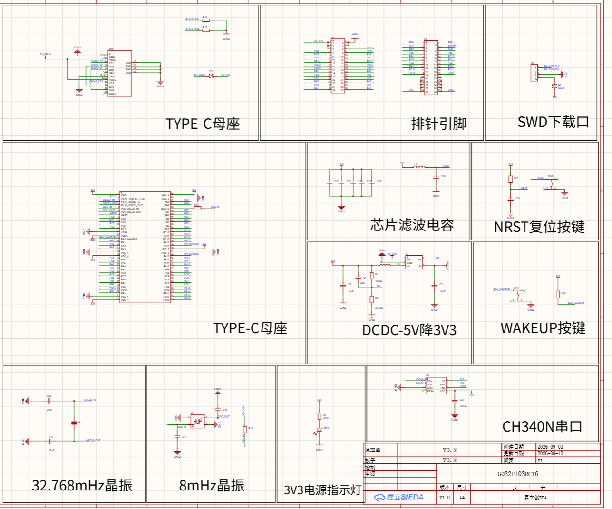

### 扩展采集板（EXP）

扩展板将网络、现场总线、采集、显示和供电模块集中到核心板接口：

- ESP-12S Wi-Fi 与 2.4 GHz 天线区域，对应节点的 ESP-AT TCP 通路；
- SN65HVD230 CAN 收发器，对应 TCP 未确认时的 CAN 回退设计；
- SPI Flash 与 BMP280 接口，对应本地 pending 日志与温度采样；
- IPS 显示接口、RS485、12 V 电压采样、按键、PWM 和 12 V → 5 V 电源链路。

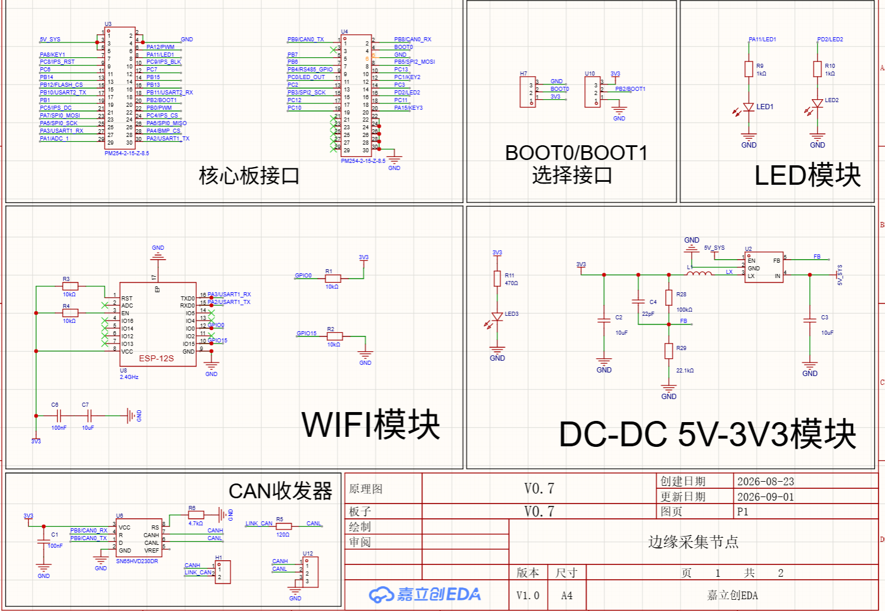

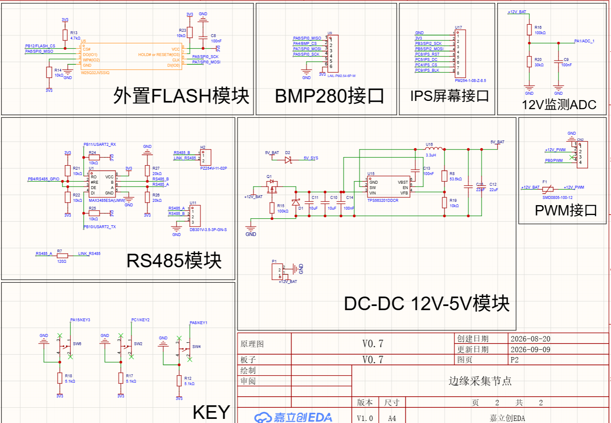

### PCB 布局预览

原理图说明电气连接，PCB 截图说明模块在两块板上的实际布局和走线分区。`PCB_ON` 为顶层预览，`PCB_OFF` 为底层预览；完整导出文件位于 [`docs/PCB/CORE/`](docs/PCB/CORE/) 与 [`docs/PCB/EXP/`](docs/PCB/EXP/)。

#### 核心控制板 PCB

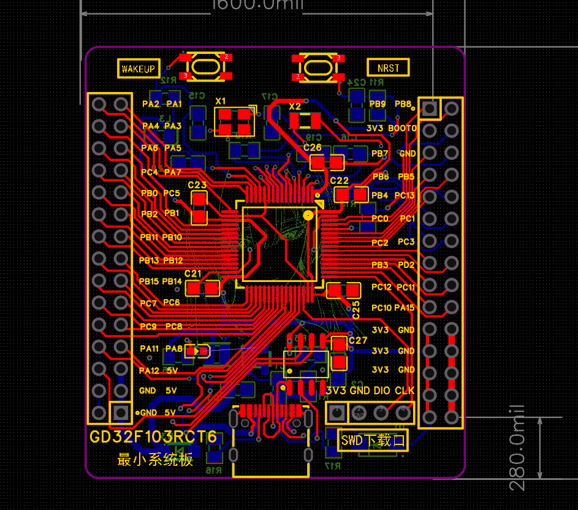

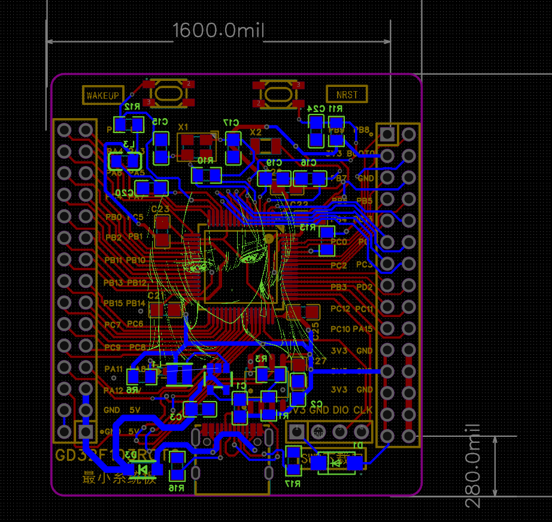

#### 扩展采集板 PCB

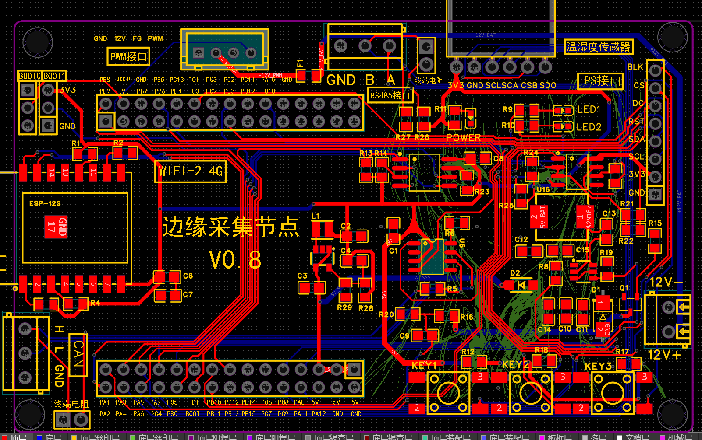

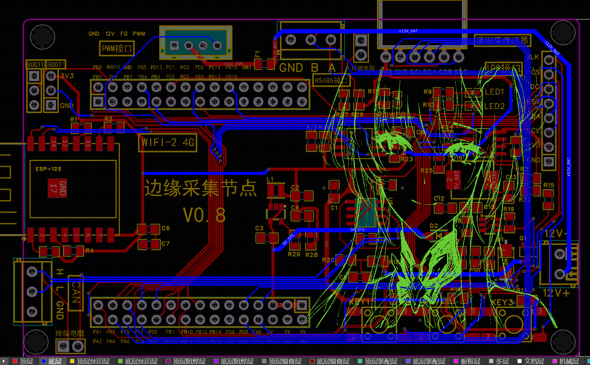
