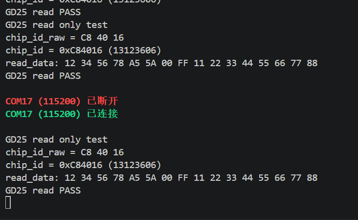
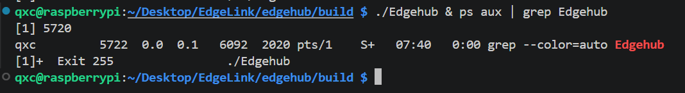
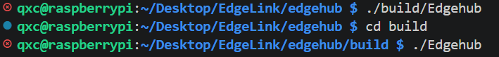
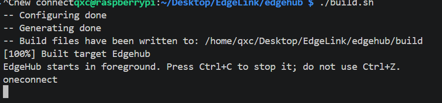
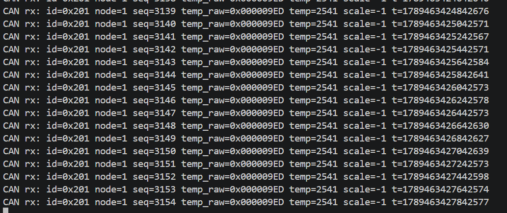

# 2026-09-15 调试笔记

## 提要

今天更换新的 ST-Link 后继续完成 EdgeNode 与 EdgeHub 的底层联调。目标是确认 GD25Q32、ESP-12S TCP 和 CAN 三条链路是否能独立工作，并把调试现象、根因和验证结果记录下来。

开始时 ST-Link 偶发烧录失败，甚至一度读不到芯片 ID；多次重新上电后恢复并完成烧录。该现象本次没有定位到确定根因，因此只记录为 **偶发问题，后续若复现再保留完整 OpenOCD 输出排查**。

## 环境

- 工程：`EdgeLink`
- 节点端：GD32 EdgeNode
- 网关端：树莓派 EdgeHub，地址 `192.168.1.112`
- 调试串口：CH340，`COM17`，`115200`
- 本次范围：GD25Q32、ESP-12S TCP、SocketCAN

## 1. EdgeNode GD25Q32 擦写、读取与掉电验证

### 实验

从 `0x00000000` 擦除一个区域，写入固定的 16 字节测试数据，再读回逐字节比较。随后将程序改为只读测试，分别在掉电前和重新上电后读取相同地址。

通过标准：芯片 ID 为 `C8 40 16`，擦除后为 `0xFF`，写入后读回数据完全一致；重新上电后仍能读到相同数据。

### 测试代码

```c
uint32_t address = 0x00000000UL;
uint8_t write_data[16] = {
    0x12, 0x34, 0x56, 0x78,
    0xA5, 0x5A, 0x00, 0xFF,
    0x11, 0x22, 0x33, 0x44,
    0x55, 0x66, 0x77, 0x88
};
uint8_t read_data[16];

if (gd25_clear(address) == 0U) {
    printf("erase fail\r\n");
    return 0;
}

if (gd25_read(address, read_data, sizeof(read_data)) == 0U) {
    printf("erase read fail\r\n");
    return 0;
}

for (i = 0U; i < sizeof(read_data); i++) {
    if (read_data[i] != 0xFFU) {
        printf("erase verify fail: index=%u data=%02X\r\n", i, read_data[i]);
        return 0;
    }
}

if (gd25_write(address, write_data, sizeof(write_data)) == 0U) {
    printf("write fail\r\n");
    return 0;
}
```

### 验证结果

首次擦写读回：

```text
chip_id_raw = C8 40 16
chip_id = 0xC84016 (13123606)
GD25 erase/write/read PASS
```

改为只读程序后，掉电前后的输出一致：

```text
GD25 read only test
chip_id_raw = C8 40 16
chip_id = 0xC84016 (13123606)
read_data: 12 34 56 78 A5 5A 00 FF 11 22 33 44 55 66 77 88
GD25 read PASS
```



- [x] 芯片识别
- [x] 擦除、写入、读回比较
- [x] 掉电后重新上电读取
- [x] BSP 未因本次测试修改

**结论：** GD25Q32 的基础读写与掉电后的数据保持已验证通过。这里验证的是指定地址的数据保持，不等同于完整的异常掉电写入恢复测试。

## 2. EdgeNode ESP-12S 联网与 TCP 建连

### 实验

目标是让 ESP-12S 加入 Wi-Fi、连接树莓派 EdgeHub 的 `8888` 端口，并向 Hub 发送测试数据 `HELLO`。

### EdgeHub 启动异常

最初运行 EdgeHub 后进程快速退出，没有任何明确错误。后台进程状态显示退出码为 `255`：



在 `main.cpp` 各个 `return -1` 分支补充错误打印后，得到：

```text
Failed to open SQLite database: /home/qxc/Desktop/Mini_Edgehub/data/edgehub.db
```

**根因：** 工程目录从 `Mini_Edgehub` 改为 `EdgeLink/edgehub` 后，SQLite 数据库路径没有同步修改。

修复路径后，EdgeHub 可以在前台启动：



### ESP-12S 首次建连失败

Node 端配置 TCP：

```c
tcp_config_struct config;
config.wifi_ssid = "ChinaNet-pehm";
config.wifi_password = "<已省略>";
config.server_ip = "192.168.1.112";
config.server_port = 8888;

if (tcp_init(&config) == TCP_SUCCESS) {
    printf("TCP CONNECTED\r\n");
} else {
    printf("TCP CONNECT FAILED\r\n");
}
```

首次输出为：

```text
Edgenode start
TCP init failed: WiFi join command failed or timed out
TCP CONNECT FAILED
```

### 根因与修改

重复烧录时，有时可以连接、有时失败；重新上电则容易恢复。原因是 MCU 复位不会复位 ESP，ESP 可能还保留上一次 TCP 连接的状态。在新的 `CWJAP` 流程开始前，它会异步上报旧连接的 `CLOSED`；旧代码把这个异步消息误判成当前入网命令失败。

修改处理逻辑：普通 AT 命令阶段忽略旧连接的 `CLOSED`，只有等待 `CIPSTART` 建连时收到 `CLOSED` 才认为当前连接失败。

```c
if (response == ESP12S_RESPONSE_CLOSED) {
    if (wait_connect == TCP_SUCCESS) {
        printf("ESP response: CLOSED during TCP connect\r\n");
        return TCP_FAIL;
    }

    printf("ESP response: CLOSED ignored before TCP connect\r\n");
    continue;
}
```

### EdgeHub 无连接提示

修复建连后，Node 端已发送 `HELLO`，但 Hub 端看不到新连接输出。原因不是 TCP 未连接，而是调试打印没有换行或刷新：

```c
printf("new connect");
```

前台终端的标准输出按行缓冲，文本没有立刻显示。修改为：

```c
printf("oneconnect\n");
fflush(stdout);
```

最终串口与 Hub 输出：

```text
Edgenode start
TCP CONNECTED
TCP TEST SEND OK: HELLO
```



- [x] ESP-12S 加入 Wi-Fi
- [x] TCP 建立到 `192.168.1.112:8888`
- [x] EdgeHub 收到连接事件
- [x] `HELLO` 测试发送成功

**结论：** ESP-12S 到 EdgeHub 的 TCP 建连和测试发送已通过。当前只验证了连接事件和测试载荷，下一阶段业务接入时还需要验证完整遥测帧被 EdgeHub 解析并写入 SQLite。

## 3. EdgeHub 前台运行与 Git 同步流程

### Ctrl+C 无法退出

之前使用 `Ctrl+Z` 挂起 EdgeHub，进程虽然不在前台，但仍占用端口。之后即使使用 `fg` 返回前台，`Ctrl+C` 也无法正常退出。

**根因：** 信号处理函数已经把 `g_running` 设为 `0`，但主循环仍写成 `while(1)`，因此 SIGINT 只改变变量，循环不会结束。

修改为：

```cpp
while (g_running != 0)
```

并让 `build.sh` 最后使用前台启动方式。以后用 `Ctrl+C` 停止，不用 `Ctrl+Z` 挂起。

### 双端 Git 提交

Node 和 Hub 共用仓库根目录的 Git 历史。每次改动前先同步；改完后只暂存本次对应目录，再提交、变基同步、推送：

```bash
# 开始改动前
git pull --rebase origin main

# Node 端改动
git add edgenode

# 或 Hub 端改动
git add edgehub

git commit -m "你的提交说明"
git pull --rebase origin main
git push origin main
```

## 4. EdgeNode 与 EdgeHub CAN 通信

### 实验

让 Node 周期性发送 CAN 遥测帧，Hub 通过 SocketCAN 接收并解析。测试帧使用：

- 标准 ID：`0x200 + node_id`，当前 Node 为 `0x201`
- DLC：`7`
- 发送周期：`200 ms`
- 温度样例：`2541`，缩放 `-1`

```c
while (1) {
    can_telemetry_send(node_id, sequence, &message);
    sequence++;
    delay_ms(200);
}
```

### 初步现象

烧录后 EdgeHub 没有 CAN 接收输出。Node 端 `Can_init()` 已成功；逐步在 `can0_data_send()` 中打印发送邮箱，得到：

```text
012333333...
```

其中 `0`、`1`、`2` 表示前三帧分别进入三个硬件发送邮箱；持续的 `3` 表示之后没有空闲邮箱。

### 根因排查

如果 CAN 总线能正常完成发送，对端会 ACK，发送邮箱应很快释放。现在三个邮箱持续被占用，说明 MCU 已把帧交给 CAN 控制器，但没有完成总线发送。

登录树莓派检查 SocketCAN：

```bash
ip -details link show can0
```

输出显示：

```text
can0: ... state DOWN
can state STOPPED
```

**根因：** 树莓派的 `can0` 接口没有启动，无法参与总线通信和返回 ACK。EdgeHub 的 `Can::init()` 能完成 socket/bind，但它不会自动把 Linux CAN 网卡设置为 UP。

启动接口并统一为 `500 kbit/s`：

```bash
sudo ip link set can0 up type can bitrate 500000
```

重新运行 EdgeHub 后，连续收到了 Node 的 CAN 遥测帧：



- [x] Node CAN 初始化
- [x] Node 将遥测帧交给 CAN 发送邮箱
- [x] 树莓派 `can0` 启动并配置为 `500 kbit/s`
- [x] EdgeHub 连续解码 `id=0x201`、`node=1`、递增序号

**结论：** Node 到 EdgeHub 的 CAN 遥测链路已通过。本次没有修改 CAN 核心发送/解析逻辑，问题是树莓派 SocketCAN 接口处于 `DOWN/STOPPED` 状态。

## 总结

### 今天已确认

- GD25Q32 可识别、擦写、读回，并能在重新上电后保持测试数据。
- ESP-12S 可以接入 Wi-Fi、与 EdgeHub 建立 TCP 连接并发送测试数据。
- EdgeHub 可以通过 `Ctrl+C` 正常退出，终端能实时显示新 TCP 连接。
- 树莓派 `can0` 启动后，EdgeHub 能连续接收并解析 Node 的 CAN 遥测帧。

### 当前边界

- TCP 目前证明了建连和 `HELLO` 测试发送；还没有证明真实 BMP280 遥测帧从 Node 解析到 EdgeHub SQLite 的完整业务闭环。
- ST-Link 偶发读不到芯片 ID 的现象没有稳定复现，暂不下结论。

### 下一步

把已经验证的底层连接到业务入口，先完成一条最小闭环：

```text
BMP280 -> Message -> Flash 记录 -> TCP 帧 -> ESP-12S -> EdgeHub -> SQLite
```

CAN 保留为已验证的备用上报通道，初版业务先不要与 TCP 同时上报，避免同一条数据重复入库。
