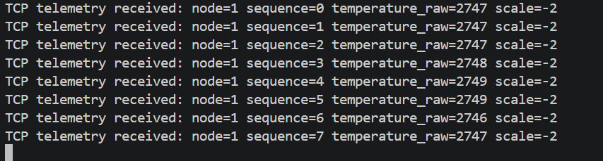
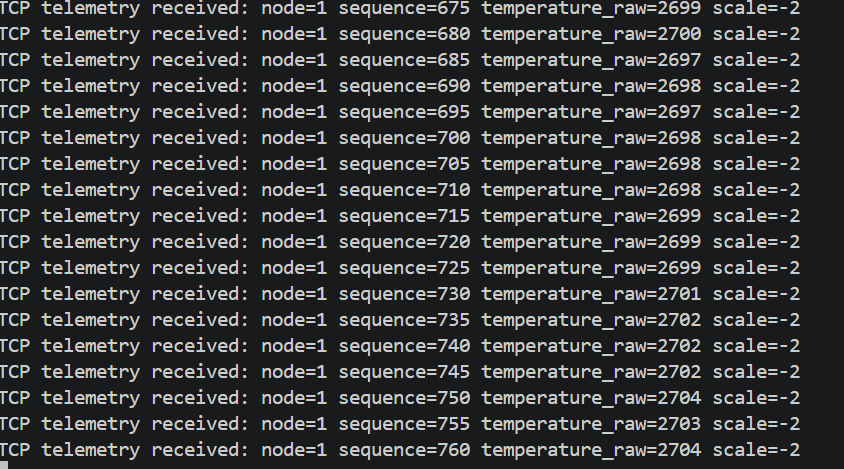
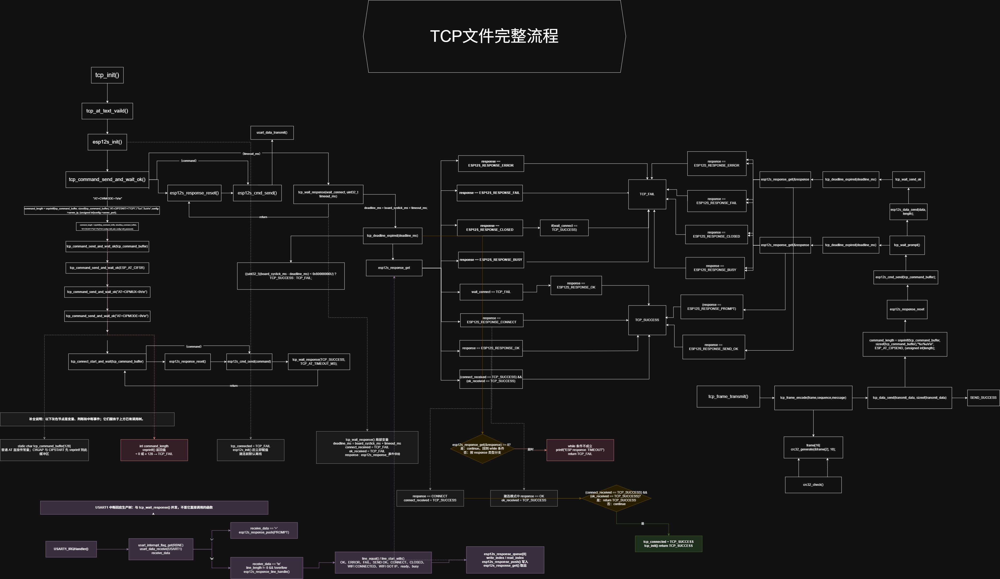

# 2026-09-16 开发笔记

## 提要

承接昨天，今天要做的事情是把链路打通：补全 EdgeNode 的 TCP 发送，让 BMP280 采集的遥测数据经 ESP-12S 上传到 EdgeHub；随后把 TCP 接入 `node_service`，验证真实 Frame 的接收与 `sequence` 递增。

## 环境

- 工程：`EdgeLink`
- 节点端：GD32 EdgeNode + BMP280 + ESP-12S
- 网关端：树莓派 EdgeHub，`192.168.1.112:8888`
- 本次范围：TCP send、Transmit、`node_service`、EdgeHub 接收打印

## 1. 补全 EdgeNode TCP 发送

### 实验

现有函数已经可以把 TCP 数据封装为一帧，但还缺少真正发送。完整的 ESP-AT 发送流程应为：

```text
发送 AT+CIPSEND=<length>\r\n
        ↓
等待 '>'
        ↓
发送指定长度的 Frame
        ↓
等待 SEND OK
```

`>` 表示 ESP-12S 已准备好接收原始数据，`SEND OK` 表示 ESP 已接受本次发送。

### 修改：等待 `>` 和 `SEND OK`

为了不让 `tcp_wait_response()` 变得臃肿，单独创建两个函数：

```c
/* CIPSEND 后 ESP 返回单字符 '>'，表示接下来可以发送原始数据。 */
static uint8_t tcp_wait_prompt(uint32_t timeout_ms)
{
    uint32_t deadline_ms = board_systick_ms + timeout_ms;
    esp12s_response_t response;

    while(tcp_deadline_expired(deadline_ms) == TCP_FAIL)
    {
        if(esp12s_response_get(&response) == 0U)
        {
            continue;
        }

        if(response == ESP12S_RESPONSE_PROMPT)
        {
            return TCP_SUCCESS;
        }

        if((response == ESP12S_RESPONSE_ERROR) ||
           (response == ESP12S_RESPONSE_FAIL) ||
           (response == ESP12S_RESPONSE_BUSY) ||
           (response == ESP12S_RESPONSE_CLOSED))
        {
            return TCP_FAIL;
        }
    }

    return TCP_FAIL;
}

static uint8_t tcp_wait_send_ok(uint32_t timeout_ms)
{
    uint32_t deadline_ms = board_systick_ms + timeout_ms;
    esp12s_response_t response;

    while(tcp_deadline_expired(deadline_ms) == TCP_FAIL)
    {
        if(esp12s_response_get(&response) == 0U)
        {
            continue;
        }

        if(response == ESP12S_RESPONSE_SEND_OK)
        {
            return TCP_SUCCESS;
        }

        if((response == ESP12S_RESPONSE_ERROR) ||
           (response == ESP12S_RESPONSE_FAIL) ||
           (response == ESP12S_RESPONSE_BUSY) ||
           (response == ESP12S_RESPONSE_CLOSED))
        {
            return TCP_FAIL;
        }
    }

    return TCP_FAIL;
}
```

这两个函数的超时和错误处理与 `tcp_wait_response()` 相同，只是分别承担“等待提示符”和“等待发送结果”的职责。

### 修改：实现 `tcp_data_send()`

`AT+CIPSEND` 必须拼接数据长度。此前用单字节数组保存 `length` 的方式无法表示多位长度，也不能形成正确 AT 指令，因此改用 `snprintf()`：

```c
uint8_t tcp_data_send(const uint8_t *data, uint8_t length)
{
    int command_length;

    if((data == NULL) || (length == 0U) || (tcp_connected == TCP_FAIL))
    {
        return TCP_SEND_FAIL;
    }

    command_length = snprintf(tcp_command_buffer, sizeof(tcp_command_buffer),
                              "%s%u\r\n", ESP_AT_CIPSEND, (unsigned int)length);
    if((command_length < 0) || ((uint32_t)command_length >= sizeof(tcp_command_buffer)))
    {
        return TCP_SEND_FAIL;
    }

    /* 新命令开始前清除旧事件，避免旧回应被本次误用。 */
    esp12s_response_reset();
    esp12s_cmd_send(tcp_command_buffer);

    if(tcp_wait_prompt(TCP_AT_TIMEOUT_MS) == TCP_FAIL)
    {
        return TCP_SEND_FAIL;
    }

    esp12s_data_send(data, length);

    if(tcp_wait_send_ok(TCP_AT_TIMEOUT_MS) == TCP_FAIL)
    {
        return TCP_SEND_FAIL;
    }

    return TCP_SEND_SUCCESS;
}
```

格式 `"%s%u\r\n"` 依次填入 `ESP_AT_CIPSEND`、无符号长度与 AT 结束符。例如长度为 16 时：

```text
AT+CIPSEND=16\r\n
```

### 修改：补全 Transmit 层

`tcp_frame_transmit()` 只负责编码和发送，符合 Transmit 层“封装 + 交给输出通道”的设想：

```c
uint8_t tcp_frame_transmit(telemetry_sample_struct *message, uint16_t sequence)
{
    uint8_t transmit_data[16];

    if(tcp_frame_encode(transmit_data, sequence, message) == 0U)
    {
        return TCP_TRANSMIT_FAIL;
    }

    if(tcp_data_send(transmit_data, sizeof(transmit_data)) == TCP_SEND_FAIL)
    {
        return TCP_TRANSMIT_FAIL;
    }

    return TCP_TRANSMIT_SUCCESS;
}
```

## 2. 把 TCP 接入 `node_service`

### 修改：集中 TCP 配置

Wi-Fi、Hub 地址和节点 ID 放进 `Config`，避免每次在 `main()` 写网络配置：

```c
const uint8_t board_id = 0x01U;

static const tcp_config_struct tcp_config =
{
    .wifi_ssid = "",
    .wifi_password = "",
    .server_ip = "192.168.1.112",
    .server_port = 8888
};

const tcp_config_struct *config_tcp_get(void)
{
    return &tcp_config;
}

#define NODE_SAMPLE_PERIOD_MS  1000U
```

### 修改：EdgeHub 接收打印

只在 `FRAME_PARSE_SUCCESS` 后打印，因为此时解析器已经得到完整 Frame；继续循环仍能处理粘包中的下一帧。

```cpp
if(parse_result == FRAME_PARSE_SUCCESS)
{
    Message_handle(&message, &frame);
    printf("TCP telemetry received: node=%u sequence=%u "
           "temperature_raw=%ld scale=%d\n",
           (unsigned int)message.nodeId,
           (unsigned int)message.sequence,
           (long)message.temperature,
           (int)message.temperatureScale);
    if(storage.isOpen() == true)
    {
        // 写入 SQLite。
    }
}
```

### 初步问题

第一次尝试时，Node 显示发送失败：


### 根因与验证

需要先启动 EdgeHub，再启动 EdgeNode。重新启动后，Hub 可以接收到来自 Node 的数据：



## 3. 修复 `sequence` 递增异常

### 初步问题

EdgeHub 可以接收数据，但 `sequence` 不是 `+1` 递增，而是 `+5`：



### 根因

`node_service` 采集周期为 1000 ms，`main()` 每 200 ms 调用一次并递增 `sequence`。因此没有发送的循环也消耗了序号：

```text
第   0 ms：sequence = 0，满足采集周期，发送 Frame 0
第 200 ms：sequence = 1，未到采集时间，不发送
第 400 ms：sequence = 2，未到采集时间，不发送
第 600 ms：sequence = 3，未到采集时间，不发送
第 800 ms：sequence = 4，未到采集时间，不发送
第1000 ms：sequence = 5，满足采集周期，发送 Frame 5
```

因此 `sequence` 不应由不知道是否真正发送的 `main()` 管理，而应由 `node_service` 在一次采集并成功上报后递增。

### 修改

```c
static uint32_t node_service_last_sample_ms;
static uint8_t node_service_has_sampled;
static uint16_t sequence;

uint8_t node_service_run_once(void)
{
    telemetry_sample_struct message;
    uint32_t now_ms = board_systick_ms;

    if((node_service_has_sampled != 0U) &&
       ((uint32_t)(now_ms - node_service_last_sample_ms) < NODE_SAMPLE_PERIOD_MS))
    {
        return 1U;
    }

    node_service_last_sample_ms = now_ms;
    node_service_has_sampled = 1U;

    if(message_collect(&message) == MESSAGE_FAIL)
    {
        printf("collection fail");
        return 0U;
    }

    /* Node 本地 Flash 存储暂时关闭，当前只验证 TCP 链路。 */
    if(tcp_frame_transmit(&message, sequence) == TCP_SEND_FAIL)
    {
        printf("tcp send fail");
        return 0U;
    }

    sequence++;
    return 1U;
}
```

### 验证结果

修正后再次烧录，EdgeHub 显示正常，TCP 通讯链路打通。

- [x] 源码 / 构建：补全 TCP 发送和 `node_service` 调度。
- [x] 烧录：修改后重新烧录。
- [x] 外设运行：ESP-12S 已发送真实遥测 Frame。
- [x] 端到端链路：EdgeHub 已接收并打印 Node 遥测数据。

## 总结

我们使用draw来绘制一下TCP部分的流程图，绘制完如下，md格式看没法放大导致看不清，imags下有原图



## 2.业务计划说明

根据三天的调试，板卡的底层基本没有问题了，现在来思考一下要实现的功能和一些重要i的细节
EdgeLink要实现的业务包含有
1.edgenode实现BMP280采集温度
2.GD25Q32实现温度信息存储
3.ESP12S负责TCP链路
4.SN65VD负责CAN链路
5，IPS+KEY实现HMI
6.TCP/CAN实现bootloader升级
接下来我们细分
先看edgenode内部
- 场景一：当TCP/CAN两路发送均失败，node内部需要保存哪些数据是已经发送完毕的，哪些是没有发送的，在重新启动的时候如果检测到TCP/CAN任意一路恢复需要将没有发送的数据发送给edgehub
- 场景二：重新启动sequence序列号会自动清0导致发送的时候，如果重新上电，edgehub记录会混乱，我们需要将sequence进行持久化保存
- 场景三：当数据已经发送到 EdgeHub，但 ACK 丢失时，Node 需要能够识别重复发送，避免 EdgeHub 重复存储同一条数据。
- 场景四：当 TCP 和 CAN 两路同时恢复时，Node 需要避免同一条缓存数据被重复发送，或由 EdgeHub 完成去重。
- 场景五：当 Node 在写入 GD25Q32 或发送数据过程中突然掉电时，重新上电后需要能够恢复未完成的数据状态。
- 场景六：当 GD25Q32 存储空间不足时，Node 需要确定旧数据的回收策略，避免覆盖尚未发送成功的数据。
- 场景七：当 EdgeHub 重启而 EdgeNode 未重启时，双方需要重新同步节点在线状态和消息序列状态。
- 场景八：当 TCP 或 CAN 链路频繁掉线和恢复时，Node 需要避免频繁重连和重复补传造成系统抖动。
- 场景九：当历史缓存数据正在补传，同时又产生新的实时采集数据时，Node 需要保证数据发送顺序和状态一致。
- 场景十：当 BMP280 采集失败时，Node 需要区分“传感器数据无效”和“通信发送失败”两种不同故障。
- 场景十一：当 FreeRTOS 下多个任务同时访问 BMP280 和 GD25Q32 共用的 SPI 总线时，需要避免总线访问冲突。
- 场景十二：当 CAN 进入 bus-off 或 TCP 长时间断开时，Node 需要能够检测链路异常并进入恢复流程。
- 场景十三：当 Bootloader 升级过程中断电或通信中断时，Node 需要保证不会启动未完整写入或校验失败的 Application。
- 场景十四：当设备因看门狗、软件复位或 OTA 复位重新启动时，Node 需要根据不同复位原因执行对应的恢复流程
- 场景十五：当 EdgeNode 收到 CRC 错误、长度异常或协议版本不匹配的数据帧时，需要丢弃异常帧且不能影响后续正常通信。
- 场景十六：当 EdgeHub 下发重复控制命令时，Node 需要避免同一条命令被重复执行，例如重复擦除 Flash 或重复触发升级。
- 场景十七：当 EdgeHub 下发的命令已经过期时，Node 需要判断该命令是否仍然允许执行，避免断线补传造成旧命令重新生效。
- 场景十八：当 Node 的 node_id 与网络中其他节点重复时，需要能够检测设备身份冲突，避免 EdgeHub 将两个节点的数据混在一起。
- 场景十九：当 Node 本地配置参数损坏或 CRC 校验失败时，需要能够恢复默认配置，而不是因为配置损坏无法启动。
- 场景二十：当修改 WiFi、服务器地址、采样周期等配置参数时突然掉电，需要保证不会留下半写入的无效配置。
- 场景二十一：当 GD25Q32 某个存储区域异常或数据校验失败时，需要能够跳过损坏记录并继续恢复后续有效数据。
- 场景二十二：当采样速度长期高于 TCP/CAN 实际发送速度时，需要处理缓存持续增长和发送积压问题。
- 场景二十三：当 FreeRTOS Queue、StreamBuffer 或 RingBuffer 已满时，需要明确是丢弃新数据、覆盖旧数据还是进入故障状态。
- 场景二十四：当高优先级任务长期占用 CPU 时，需要避免采集、通信或 HMI 等低优先级任务发生饥饿。
- 场景二十五：当多个任务竞争 SPI、UART 等共享资源时，需要避免死锁、长时间占锁以及优先级反转。
- 场景二十六：当系统虽然没有死机，但某个任务已经卡死时，需要能够通过软件看门狗或任务心跳发现局部故障。
- 场景二十七：当 ESP12S 模块异常复位而 MCU 没有复位时，Node 需要检测到网络模块状态丢失并重新初始化 TCP 链路。
- 场景二十八：当 ESP12S 已连接 WiFi 但 TCP Server 不可达时，需要区分“WiFi正常”和“TCP链路异常”，不能把两者视为同一个状态。
- 场景二十九：当 CAN 总线上出现大量高优先级报文导致 Node 报文长期无法发送时，需要识别发送拥塞而不是简单判断为 CAN 断线。
- 场景三十：当收到非法 CAN ID、未知消息类型或来自未授权节点的数据时，需要过滤异常报文，避免进入业务处理流程。
- 场景三十一：当 EdgeHub 要求 Node 修改采样周期时，需要保证周期切换过程中不会产生重复采样、漏采或任务调度异常。
- 场景三十二：当 HMI 用户正在修改参数，同时 EdgeHub 远程修改同一参数时，需要定义本地配置和远程配置谁具有更高优先级。
- 场景三十三：当系统时间尚未同步或时间发生跳变时，需要避免历史数据因为 timestamp 异常而在 EdgeHub 中排序错误。
- 场景三十四：当 board_systick_ms 等系统计时器发生整数回绕时，超时判断必须仍然正确。
- 场景三十五：当升级包对应的 MCU 型号、硬件版本或产品型号不匹配时，Bootloader 必须拒绝升级。
- 场景三十六：当收到版本号低于当前固件的升级包时，需要明确是否允许固件降级。
- 场景三十七：当 OTA 固件 CRC 正确但复位向量、栈地址等 Application 基本信息非法时，Bootloader 仍然不能跳转执行。
- 场景三十八：当升级成功但新版 Application 启动后立即反复崩溃时，需要考虑是否触发版本回滚或进入安全模式。
- 场景三十九：当 Node 首次上电、恢复出厂设置和普通重启时，需要区分三种启动场景并执行不同初始化流程。
- 场景四十：当按键误触、长按或机械抖动时，HMI 需要避免错误触发恢复出厂、升级等高风险操作。
- 场景四十一：Node 采集成功后、尚未来得及写 Flash 或发送过程中突然复位。

## EdgeHub 长期业务场景规划

EdgeHub 不只是接收 TCP/CAN 数据后写入 SQLite。它是 Node 的可靠接收端、确认端、去重端，以及设备状态和后续运维能力的集中点。

第一版先聚焦以下闭环，不把 OTA、HMI、多 Hub 等长期功能混进当前实现：

```text
完整 Frame 到达
        ↓
解析与 CRC 校验通过
        ↓
SQLite 以 (node_id, sequence) 去重并持久化
        ↓
发送 ACK
        ↓
Node 标记本地缓存记录已确认
```

- 场景一：当 TCP 客户端只发到半帧时，EdgeHub 不能提前解析或写库，必须由 RingBuffer 保留字节并等待完整 Frame。
- 场景二：当一次 `recv()` 中收到多帧时，EdgeHub 必须逐帧解析，不能只处理第一帧。
- 场景三：当收到 CRC 错误、长度异常、魔数错误或协议版本未知时，应丢弃当前异常 Frame，且不影响后续正常数据。
- 场景四：当单个客户端持续发送无效或不完整数据时，需要限制 RingBuffer 占用；达到阈值后关闭该客户端，避免异常节点耗尽内存。
- 场景五：当 TCP 同时接入多个 Node 时，每条连接必须拥有独立的接收缓存和解析状态，不能混用数据。

- 场景六：当 Frame 解析成功但 SQLite 写入失败时，EdgeHub 不能回复 ACK；否则 Node 会误以为数据已持久化。
- 场景七：当 SQLite 已成功写入但 ACK 丢失时，Node 会重传；EdgeHub 必须允许重传并再次回复 ACK。
- 场景八：当同一 `(node_id, sequence)` 重复到达时，只保存一条遥测数据，但仍回复 ACK；SQLite 唯一约束是最终防线。
- 场景九：当相同 `(node_id, sequence)` 的载荷不同，说明可能发生节点 ID 冲突、sequence 损坏或异常数据注入；不能静默覆盖，应记录冲突事件。
- 场景十：当 EdgeHub 重启后 Node 补传历史数据时，去重依据必须从 SQLite 恢复，不能只保存在内存中。

- 场景十一：当 EdgeHub 成功接收数据时，应记录 `received_at`，作为当前 V1 的可信接收时间。
- 场景十二：当 Node 尚未完成 RTC/NTP 校时时，Node 时间不能当作可靠绝对时间；后续应分别保存 `sampled_at` 和 `received_at`。
- 场景十三：当 TCP socket 仍存在但长期没有有效遥测时，不能认为节点在线；在线状态应由 freshness 时间窗口决定。
- 场景十四：当 Node 主动断开、Wi-Fi 掉线或 TCP 超时时，EdgeHub 更新连接状态；是否离线仍根据最后有效遥测时间判断。
- 场景十五：当 TCP 与 CAN 数据到达时，都先转换为内部 `Message`，再使用同一套校验、去重和入库规则。
- 场景十六：当相同 `(node_id, sequence)` 同时由 TCP 与 CAN 到达时，只入库一次，并记录实际接收通道。
- 场景十七：当 V1 正常运行时，TCP 作为主上报通道，CAN 保留为独立验证和后续备用通道；不要双路同时上报同一遥测数据。
- 场景十八：当同一个 `node_id` 同时建立多个 TCP 连接，或不同设备使用相同身份时，需要拒绝、替换或告警，不能混合两台设备的数据。

- 场景十九：当 SQLite 无法打开、表创建失败或磁盘不可写时，EdgeHub 必须明确失败并拒绝接收，不能假装数据已经保存。
- 场景二十：当数据库写入变慢时，需要限制客户端数、接收缓存和待处理队列，避免内存无限增长。
- 场景二十一：当历史数据长期增长时，需要规划查询索引、保留周期、导出和归档，避免 SQLite 无限增长。
- 场景二十二：当数据库损坏或迁移失败时，应保留原数据库和错误日志，不能直接覆盖历史数据。
- 场景二十三：当 EdgeHub 下发命令时，每条命令应有 `command_id`；Node 收到重复命令时不能重复执行高风险操作。
- 场景二十四：当 Node 断线恢复后收到旧命令时，应根据命令过期时间拒绝已失效操作。
- 场景二十五：当 EdgeHub 保存 OTA 包时，必须校验目标 MCU、硬件版本、固件版本、长度和 CRC/hash；升级后 Node 需上报新版本。
- 场景二十六：当未知 Node、非法 CAN ID、异常 TCP 数据或未授权命令到达时，不能进入业务处理流程。
- 场景二十七：当节点连接/断开、解析失败、重复帧、数据冲突、SQLite 失败、ACK 失败或 CAN 状态变化时，EdgeHub 应记录关键日志。
- 场景二十八：当需要查看节点状态时，应能查询最后在线时间、最后 sequence、连接状态、累计接收数、重复帧数和异常次数。
- 场景二十九：当 TCP 监听失败、`can0` DOWN、SQLite 打不开或进程退出时，必须有明确日志和可恢复的启动方式。
- 场景三十：当日志长期运行时，需要有日志等级、轮转和保留策略，避免耗尽磁盘。

其实做起来还挺复杂的，所有的基础建立在tcp，can双向通信上面，当前的edgenode仅能发送并不支持接受，我们需要修改
接收函数是阻塞的
为了避免后徐业务逐渐复杂导致修改困难，我们现在需要移植freertos