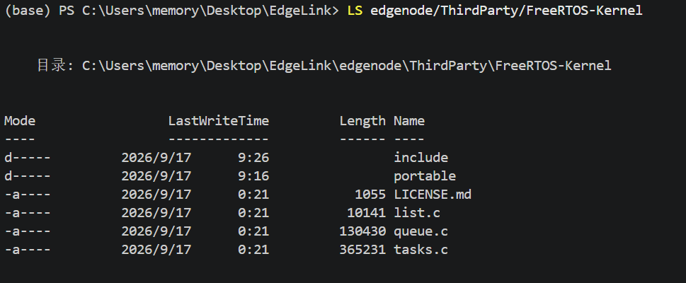

# 2026-09-17 FreeRTOS 移植与第一个任务

## 提要

今天先把昨天没有裁剪好的 FreeRTOS 裁剪成最小内核，然后在当前 GD32F103RCT6 项目里完成第一次 FreeRTOS 启动验证。

本次不是把原有采集、TCP、Flash 业务全部改成多任务，而是先完成最小的两 LED 任务调度。这样出了问题时，可以判断是 FreeRTOS 的端口、Tick、任务创建有问题，还是原业务代码本身有问题。

## 环境

- MCU：GD32F103RCT6，Cortex-M3。
- 编译器：ARM GCC。
- 构建方式：`mingw32-make -C edgenode clean all`。
- FreeRTOS：`ThirdParty/FreeRTOS-Kernel`。
- 内存策略：只使用静态任务，不使用 FreeRTOS 动态内存分配。
- 本次测试范围：SysTick 桥接、SVC/PendSV 映射、Idle 任务、两个 LED 任务的创建与调度。

## 1. FreeRTOS 裁剪

首先把 FreeRTOS 裁剪成最小内核。从官方下载内容中保留 `FreeRTOS-Kernel`，不保留 AWS、网络协议栈、测试、示例与其他 CPU/编译器端口；许可证文件仍然保留。

`portable` 中保留 `GCC/ARM_CM3`。它是与编译器和 CPU 内核相关的移植层：同一个 FreeRTOS 内核，换成 IAR、Keil 或不同 Cortex-M 内核时，使用的就是不同 port 文件。



当前构建实际编译的最小内核源码是：

```text
tasks.c        任务调度、阻塞、恢复等核心逻辑
queue.c        队列；后面任务间传递数据会用到
list.c         内核任务链表
port.c         Cortex-M3 的 SVC、PendSV、SysTick 端口
```

## 2. 添加 `FreeRTOSConfig.h`

`FreeRTOSConfig.h` 名称不可更改。它放在 `edgenode/User/App/FreeRTOSConfig.h`，Makefile 与 clangd 的 include 路径都能找到它。

它决定内核怎样运行，例如：

- 一秒有多少个 Tick：当前配置 `1000`，即 1 ms。
- 是否抢占调度：开启。
- 第一阶段是否使用动态内存：关闭，先用静态任务。
- 是否启用软件定时器、协程、流缓冲：当前都关闭。
- Cortex-M3 的中断优先级规则。
- 栈溢出、断言失败时如何停住，方便 SWD 排查。

当前几个容易混淆的配置如下：

```c
#define configSUPPORT_STATIC_ALLOCATION 1
#define configSUPPORT_DYNAMIC_ALLOCATION 0

#define configTICK_RATE_HZ 1000U
#define configMAX_PRIORITIES 5

#define configKERNEL_INTERRUPT_PRIORITY (15U << 4U)
#define configMAX_SYSCALL_INTERRUPT_PRIORITY (5U << 4U)

#define xPortPendSVHandler  PendSV_Handler
#define vPortSVCHandler     SVC_Handler
#define xPortSysTickHandler FreeRTOS_SysTickHandler
```

静态分配的意思是：任务的 TCB 和任务栈不是 FreeRTOS 临时申请的，而是我自己提前准备数组后传给 `xTaskCreateStatic()`。优点是内存数量、位置和上限都明确；缺点是每创建一个任务都必须自己准备对应的 TCB 与栈。

中断优先级这里使用 `PRE4_SUB0`，即四位全部用于抢占优先级，不使用子优先级。数值 `0` 最高、`15` 最低；后面如果 USART/CAN 中断要调用 `xTaskNotifyFromISR()` 等 API，中断优先级必须保持在 `5~15`。

## 3. 为什么不能直接把 `SysTick_Handler` 交给 FreeRTOS

原工程中 `board_time.c` 的 `SysTick_Handler()` 每 1 ms 增加一次 `board_systick_ms`，很多旧代码依赖它：BSP 初始化延时、BMP280、IPS、Flash/SPI 超时、TCP 超时等。

FreeRTOS 也必须使用 SysTick 来推进内核时间、唤醒延时到期的任务并判断是否需要 PendSV 切换。如果直接让 `port.c` 占用 `SysTick_Handler`，原来的 `board_systick_ms` 就不再递增，旧代码可能卡在 `delay_ms()` 或超时判断中。

所以当前项目采用一个过渡桥：

```text
调度器未启动：
SysTick_Handler() -> board_systick_ms++

调度器已启动：
SysTick_Handler() -> FreeRTOS_SysTickHandler()
                     -> vApplicationTickHook()
                     -> board_systick_ms++
```

这样 SVC 与 PendSV 直接由 FreeRTOS 接管，而 SysTick 仍留下一个工程自己的入口。启动前保留裸机毫秒计时，启动后由 FreeRTOS Tick Hook 继续维护同一个 `board_systick_ms`。

这不是说 `delay_ms()` 已经等价于所有 FreeRTOS API。调度器启动后，普通任务中的长等待应改用 `vTaskDelay()` 或 `vTaskDelayUntil()`；硬件驱动中的短延时和 ISR 中的代码不能随意调用 `vTaskDelay()`。

## 4. 静态 Idle 任务与异常 Hook

因为关闭了动态内存，内核创建 Idle Task 时没有可用的堆，因此我在 `User/App/FreeRtos/rtos_hooks.c` 提供：

```c
static StaticTask_t idle_task_tcb;
static StackType_t idle_task_stack[configMINIMAL_STACK_SIZE];

void vApplicationGetIdleTaskMemory(StaticTask_t **tcb,
                                   StackType_t **stack,
                                   configSTACK_DEPTH_TYPE *stack_size)
{
    *tcb = &idle_task_tcb;
    *stack = idle_task_stack;
    *stack_size = configMINIMAL_STACK_SIZE;
}
```

这里 `StaticTask_t` 是 Idle 任务的管理档案，`StackType_t[]` 才是 Idle 任务真实使用的栈。此前把栈误写成 `StaticTask_t[]` 会导致指针类型不匹配，说明 TCB 和栈的用途不能混淆。

同时实现了断言和栈溢出 Hook。它们的职责不是继续打印，而是先关中断并停住：断言或栈溢出时，栈和中断环境可能已经不可靠，继续 `printf()` 反而会消耗更多栈或卡在串口发送。此时应该用 SWD 看调用栈，以及 `file`、`line`、`task_name` 参数。

## 5. 第一个任务：LED 任务如何创建

任务函数不是普通函数，不能在 `main()` 中直接执行。任务通常包含无限循环；如果 `main()` 直接调用 `led1_task()`，它会一直停在这个循环里，后面的任务和 `vTaskStartScheduler()` 都不会执行。

所以把任务入口函数设为 `static`，只在 `rtos_task.c` 内部使用：

```c
static void led1_task(void *argument)
{
    TickType_t last_wake_time;

    (void)argument;
    last_wake_time = xTaskGetTickCount();

    while (1)
    {
        led1_toggle();
        vTaskDelayUntil(&last_wake_time, pdMS_TO_TICKS(200U));
    }
}
```

然后给任务单独准备 TCB、栈，并通过 `xTaskCreateStatic()` 创建：

```c
static StaticTask_t led1_task_tcb;
static StackType_t led1_task_stack[256];

task_handle = xTaskCreateStatic(led1_task,
                                "led1",
                                256,
                                NULL,
                                2,
                                led1_task_stack,
                                &led1_task_tcb);
configASSERT(task_handle != NULL);
```

这里的 `256` 单位不是字节，而是 `StackType_t`。在 Cortex-M3 上一个元素为 4 字节，因此 LED1 栈为 `256 × 4 = 1024` 字节。LED2 先延时 100 ms，再按照 200 ms 周期翻转，因此两灯形成 100 ms 相位差。

对外只暴露一次性创建函数：

```c
void led_tasks_create(void)
{
    led1_task_create();
    led2_task_create();
}
```

`main()` 的职责因此变得很明确：先完成旧 BSP 初始化，再创建任务，最后启动调度器。

```c
int main(void)
{
    setvbuf(stdout, NULL, _IONBF, 0);
    init_all();
    led_tasks_create();
    printf("Edgenode start\r\n");

    vTaskStartScheduler();

    while (1)
    {
    }
}
```

`vTaskStartScheduler()` 正常情况下不会返回。之后 CPU 的执行权由 FreeRTOS 管理：第一次通过 SVC 恢复任务现场，之后由 SysTick 判断时间与就绪任务，真正的上下文切换在 PendSV 中完成。

## 6. 构建与硬件验证

### 构建

```powershell
mingw32-make -C edgenode clean all
```

构建与链接通过，生成：

```text
build/edegnode.elf
build/edegnode.bin
```

最后一次构建尺寸：

```text
text    data    bss    dec
21712   116     4624   26452
```

### 验证结果

- [x] 源码 / 构建：FreeRTOS 内核、端口层、任务源码和 Hook 已参与编译、链接。
- [x] 烧录：本次验证已通过。
- [x] 外设运行：两个 LED 静态任务已验证能够由 FreeRTOS 调度。
- [ ] 物理信号 / 显示：本次没有单独测量 SysTick、PendSV 或 LED 引脚波形。
- [ ] 端到端链路：本次没有运行 BMP280 → Flash/TCP/CAN 的原业务链路。

## 7. 本次审查与修改

在最后一次审查中，发现并修改了以下问题：

1. `main()` 直接调用 `led1_task()`、`led2_task()`。

   任务入口含无限循环，直接调用会让第一个任务占住 CPU，调度器无法启动。现在改为 `led_tasks_create()`，由调度器调用私有任务入口。

2. `rtos_task.h` 的函数声明与任务入口函数签名冲突。

   头文件原来声明为 `void led1_task(void)`，实现却是 `static void led1_task(void *argument)`。现在头文件只公开 `led_tasks_create()`。

3. Idle 栈类型错误。

   Idle 栈曾写成 `StaticTask_t[]`，现在改成 `StackType_t[]`；TCB 与任务栈分别对应不同的内存用途。

4. `vTaskDelay()`、`xTaskGetSchedulerState()` 链接未定义。

   这两个 API 在当前内核版本需要在 `FreeRTOSConfig.h` 中显式开启。现在已增加 `INCLUDE_vTaskDelay` 与 `INCLUDE_xTaskGetSchedulerState`。

5. 断言和栈溢出 Hook 中直接 `printf()`。

   断言可能发生在 ISR、临界区或调度器启动阶段；栈溢出时栈也可能已经损坏。现在改为优先关中断并停住，用 SWD 保留和查看现场。

6. 未检查 `xTaskCreateStatic()` 返回值。

   现在保存返回的 `TaskHandle_t`，并用 `configASSERT()` 检查是否成功创建。

审查后的剩余结论：目前 `main()` 只创建 LED 演示任务，原来的 `node_service_run_once()` 没有放进任何 FreeRTOS 任务。因此这次验证证明的是 FreeRTOS 移植和最小任务调度成功，不代表采集、Flash、TCP/CAN 业务已经完成 RTOS 化。

## 总结

今天已经确认的内容：

- 当前 GD32F103RCT6 项目已经能启动 FreeRTOS。
- SVC、PendSV、SysTick 的职责已经接入当前工程。
- 旧的 `board_systick_ms` 在调度器前后都能继续维护。
- 两个 LED 静态任务能够被调度器创建和运行。
- 静态 Idle 内存、栈溢出 Hook、断言处理已经接入。

今天仍未确认的内容：

- 节点业务任务是否能在 RTOS 下保持原来的采集与传输行为。
- LED 任务 1 KiB 栈是否有足够余量；后续加业务后需要用栈高水位 API 实测。
- ISR 到任务的通知、队列、互斥锁，以及共享 SPI0 的并发保护。
- 真实的端到端数据链路和异常恢复。

下一步：创建一个 `NodeTask`，只把原来的 `node_service_run_once()` 与 200 ms 周期搬入该任务，先确认原业务在 FreeRTOS 下没有退化，再决定是否把 TCP、存储、显示进一步拆分为多个任务。
